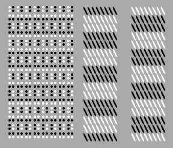
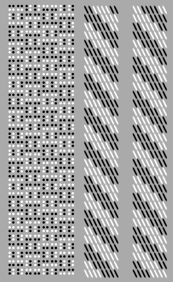
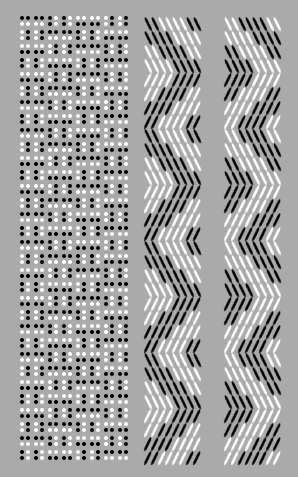
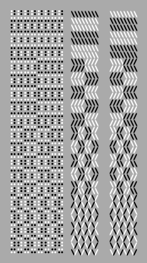

# tablet weaving simulation

Tablet weaving is an ancient form of pattern production using cards
which are rotated to provide different sheds between warp
threads. It’s used to produce long strips of fabric, and the starting
bands and borders that form part of a larger warp weighted weaving.

Tablet weaving is extremely complex, so in a similar manner to the 4
shaft loom, we devised a language/notation for understanding it
better. In the same way as before, this language can be used either to
drive a simulation, or can be followed when weaving.

The language consists of simple instructions, for example:

    (weave-forward 16)

The card rotations are shown on the left for each of the 8 cards, the
predicted weaving is on the right for the top and bottom of the
fabric. This is setup with a double face weave on square cards, so
black, black, white, white in clockwise from the top right
corner. `(weave-forward 16)` turns all the cards a quarter turn, adds
one weft and repeats this 16 times.

We can offset the cards from each other first to make a
pattern. `rotate-forward` turns only the specified cards a quarter
turn forward without weaving a weft:

    (rotate-forward 0 1 2 3 4 5)
    (rotate-forward 0 1 2 3)
    (rotate-forward 0 1)
    (weave-forward 32)

One interesting limiation of tablet weaving is that We can’t really
weave 32 forward quarter rotates without completely twisting up the
warp so we need to go forward/back 8 instead to make something
physically weavable:

    (rotate-forward 0 1 2 3 4 5)
    (rotate-forward 0 1 2 3)
    (rotate-forward 0 1)
    (repeat 4
      (weave-forward 4)
      (weave-back 4))

Now we get a zigzag – if we change the starting pattern again:

    (rotate-forward 0 1 2 3 4 5 6)
    (rotate-forward 0 1 2 3 4 5) 
    (rotate-forward 0 1 2 3 4)
    (rotate-forward 0 1 2 3)
    (rotate-forward 0 1 2)
    (rotate-forward 0 1)
    (rotate-forward 0)
    (repeat 4
      (weave-forward 4)
      (weave-back 4))

This zigzag matches the stitch direction better. Instead of the
rotation offsets we can also use twist to form other patterns. The
`twist` command takes a list of cards to twist, and results in these
cards effectively reversing their turn direction compared to the
others.

    (weave-forward 7)
    (twist 0 1 2 3)
    (weave-back 1)
    (repeat 2
      (weave-forward 2)
      (weave-back 2))
    (weave-forward 1)
    (twist 2 3 4 5)
    (weave-back 1)
    (repeat 2
      (weave-forward 2)
      (weave-back 2))
    (weave-forward 1)
    (twist 1 2 5 6)
    (weave-back 1)
    (repeat 2
      (weave-forward 2)
      (weave-back 2))

With double faced weave, the twist needs to happen when the cards are
in the right rotation – if we repeat this example, but change the
first `(weave-forward 7)` to `(weave-forward 6)` we get this instead:

If we put the twists in the loops, we can make small programs with
complex results. You can see a comparison with the woven form below,
this was created by following the program manually.

    (weave-forward 1)
    (twist 0 2 4 6)
    (repeat 4
      (twist 3)
      (weave-forward 4)
      (twist 5)
      (weave-back 4))

   
This language was the first we created that describes the actions and
movement of the weaver. It was mainly of use in understanding the
complexities of tablet weaving, indeed some of this remains a mystery
- the calculation of the inverse side of the weaving is not correct,
problably due to the double twining of the weave. In some cases it has
very different results, in others it matches perfectly. Further
experimentation is needed.

This langauge also started investigations into combining the tablet
and warp weighted weaving techniques into a single notation
system. This remains a challenge, but pointed in the direction of a
more general approach being required - rather than either a loom
centred or weaver centred view.
