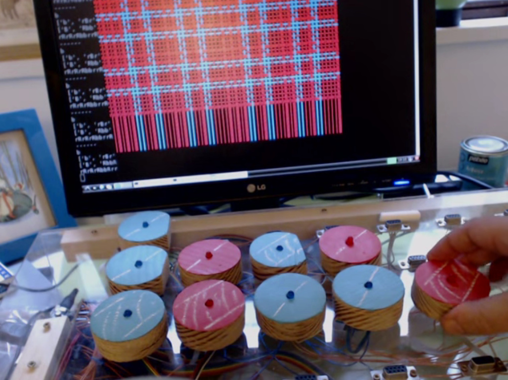
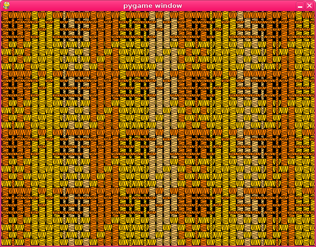
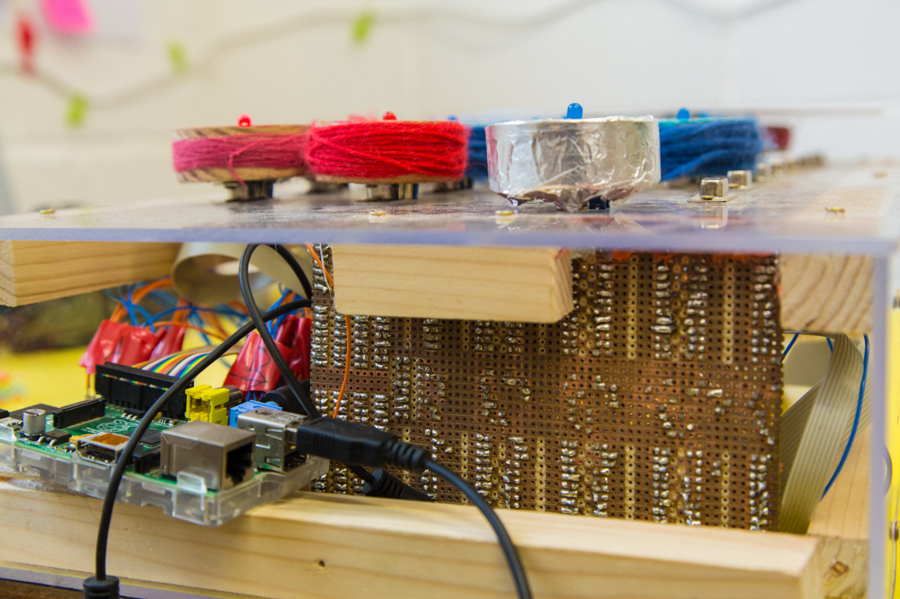

# Flotsam Raspberry Pi Simulation

If we are to consider weaving as a digital technology, as it involves
combinations of discrete elements or threads, then we can place it in
the same category as technology that involves combinations of discreet
voltages - the digital tools many of us use daily in our lives at
present. When we do this we see many differences between the design of
these tools, how we interact with them, and their relationship to our
bodies. One of the important strands of research on the
WeavingCodes:CodingWeaves project turned out to be looking for how the
design of weaving tools, having been honed over a long period of time
- can inform the design of programming tools and help us with some of
their limitations.

Flotsam is a prototype screenless tangible programming language
largely built from driftwood. It was constructed in order to
experiment with new types of "tangible hardware" for teaching children
programming without the need for a screen. It is based on the same L
system as used for the first mathematickal arts workshop and describes
weave structure and patterns with wooden blocks representing yarn
width and colour. The L system production rules for the warp/weft yarn
sequences are constructed from the the positions the blocks are
plugged into using a custom hardware interface.

The weaving simulation runs on a Raspberry Pi computer and the overall
system is designed to describe different weave patterns than those
possible with Jacquard looms, by including simple additional yarn
properties beyond colour. The version shown in the figure above is
restricted to plain weave, but more complex structures can be created
as shown below:

The flotsam tangible hardware was used in primary schools and tutoring
with children, and was designed so the blocks could be used in many
different ways - for example, experiments beyond weaving included an
interface with the Minecraft 3D game and a music synthesiser.

As before, an L system programming approach is good for quick
exploration of the huge variety of weaving patterns. However, one of
the core goals for the WeavingCodes project was to develop artefacts
and interfaces for understanding how weavers think, and this was a
markedly different approach - so proved challenging for this aim.

The design of the system itself needed further development, as the
plugs were tricky to position correctly - particually for small
fingers.

However, during use we observered the findings of ["Comparing the Use
of Tangible and Graphical Programming Languages for Informal Science
Education":
http://cci.drexel.edu/faculty/esolovey/papers/chi09.horn.pdf] in that
the tangible interace encouraged collaborative learning beyond that
possible with a traditional keyboard and screen interface designed for
a single user. 

Another aspect possible with this kind of interface is an increased
role of touch - for example wrapping the tokens with the yarn that
they represented (and the replication tokens in tinfoil) proved a very
simple but effective way to allow people to feel the symbolic
representation rather than needing to see it, increasing the range of
senses in use during programming as well as making it much easier to
explain.

