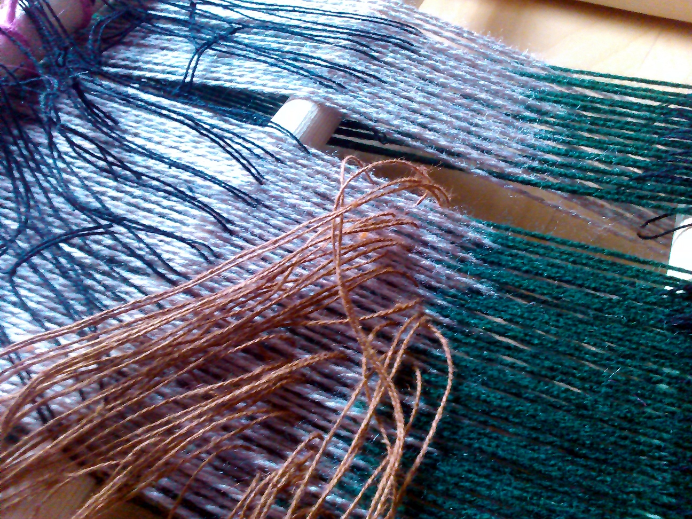
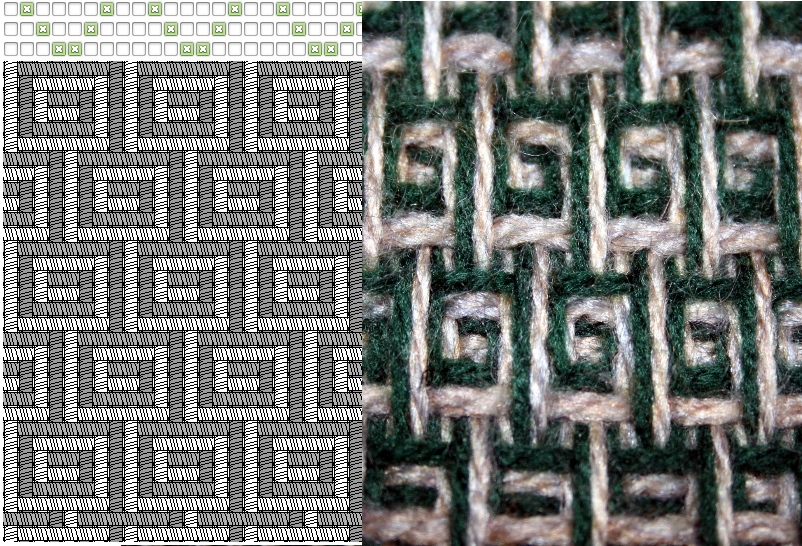

# Four shaft loom simulation

The four shaft loom simulation inverts most weaving simulation
concepts. Because we need to gain knowledge about the potential
computational processes involved in weaving - we need to deeply
understand how a loom works. So instead of defining the pattern you
want directly, and then being given instructions for how to weave it,
with this simulation you describe the set up of a specific loom first,
and it tells you what patterns emerge. 

This involved writing a model that needed to include calculating the
shed (the gap between ordered warp thread) by looking at each shaft in
turn and using an "OR" operation on each warp thread to calculate
which ones are picked up. This really turns out to be the core of the
algorithm – here’s a snippet:

    ;; 'or's two lists together:
    ;; (list-or (list 0 1 1 0) (list 0 0 1 1)) => (list 0 1 1 1)
    (define (list-or a b)
      (map2
       (lambda (a b)
         (if (or (not (zero? a)) (not (zero? b))) 1 0))
       a b))
    
    ;; calculate the shed, given a lift plan position counter
    ;; shed is 0/1 for each warp thread: up/down
    (define (loom-shed l lift-counter)
      (foldl
       (lambda (a b)
         (list-or a b))
       (build-list (length (car (loom-heddles l))) (lambda (a) 0))
       (loom-heddles-raised l lift-counter)))

This program is good for understanding how the loom setup corresponds
to the patterns it produces, and is much easier to tweak, experiment
and play with than a real loom which would need re-warping. Here are
some example weaves. Colour wise, in all these examples the order is
fixed – both the warp and the weft alternate light/dark yarns.

The next step was to try weaving the structures with real threads in
order to test the patterns produced were correct. A frame loom was
constructed to weave these patterns.

Here the shafts are sleyed to pick up the warp as defined by the
simulation's input (the toggle buttons). The threads (which form
heddles) are tied on to wooden poles which are pulled in different
combinations during weaving. This is a similar approach as used in
warp weighted looms and much faster than counting threads manually
each time. It’s important to use thinner threads than the warp, but
you need to put quite a bit of tension on them so they need to be
strong. There is something very appropriate in the context of this
project about coding threads with threads in this way.

In relation to livecoding, a form of improvisation is required when
weaving, even when using a predefined pattern. There is a lot of
reasoning required in response to issues of structure that cannot be
defined ahead of time. You need to respond to the interactions of the
materials and the loom itself. The most obvious problem you need to
think about and solve ‘live’ as you go, is the selvedge – the edges of
the fabric. In order to keep the weave from falling apart you need to
‘tweak’ the first and last warp thread based on which weft yarn colour
thread you are using. The different weft threads also need to go
over/under each other in a suitable manner which interacts with this.

Here’s a closeup of the meander pattern compared to the
simulation. The differences are due to the long float threads, which
cause the pattern to distort further when the fabric is removed from
the loom and the tension is gone. The extent to which it is possible
or desirable to include these material limitations into a weaving
language or model was one of our main topics of inquiry when talking
to our advisors [Leslie], as well as the inability of even the highest
range simulation software to do this fully.

In total there were three types of limitations noted. One is the
selvedge, the lack of which in weaving simulations, models and
notation systems was mentioned earlier – another is floats as seen
here.

The third is more subtle: some sequences of sheds cause problems when
packing down the weft, for example if you are not too careful you can
cause the ordering of the weft colours to be disrupted in some
situations when they can overlap.

This was a step in the right direction, as the model represents
weaving via the shed operation rather than a cellular matrix, it
brings it closer to a continuous form.
 
