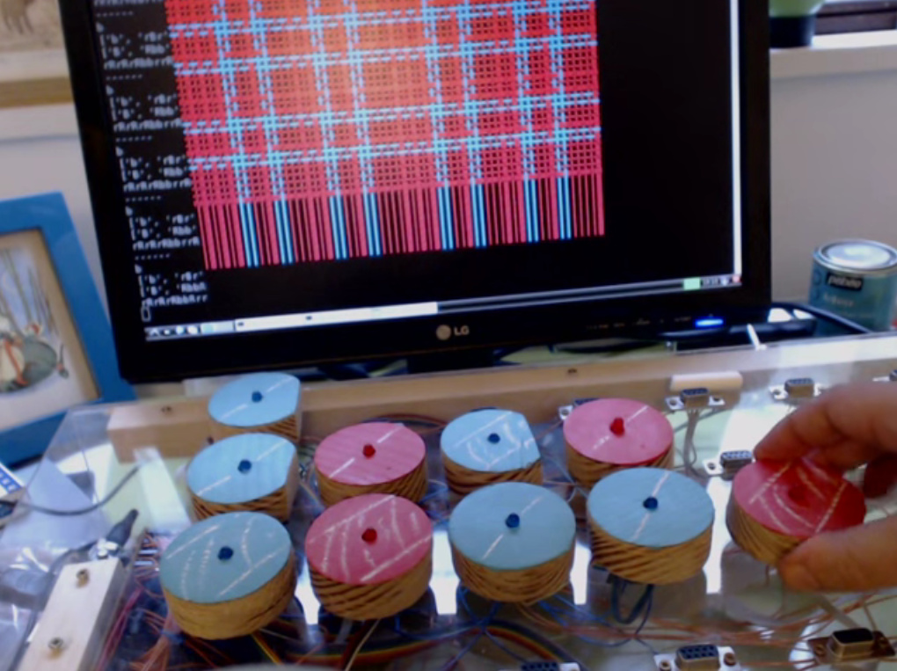
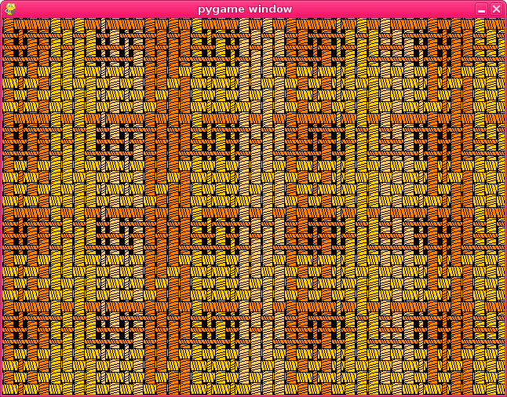
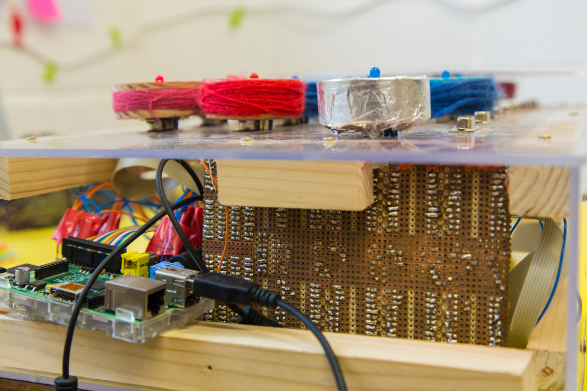

# Flotsam Raspberry Pi Simulation

Since antiquity, weaving has been a fundamentally *digital*
technology, as it involves combinations of discrete elements or
threads. For this reason we place it in the same category as modern
digital technology which involves combinations of discrete voltages --
computers, smartphones and so on. When we do this we see many
differences between the design of these tools, how we interact with
them, and their relationship to our bodies. One of the important
strands of research on our project turned out to be looking for how
the design of weaving tools, having been honed over very many
generations and across many cultures -- can inform the design of
programming tools and help us with some of their limitations.

*Flotsam* is a prototype, screen-less tangible programming language
largely built from driftwood. We constructed it in order to experiment
with new types of "tangible hardware", for teaching children
programming, without the need for a traditional keyboard-and-screen,
single user interface. It is based on the same L-system as used for
the first mathematickal arts workshop, and describes weave structure
and patterns with wooden blocks representing yarn width and
colour. The L-system rules for the warp/weft yarn sequences are
constructed from the positions the blocks are plugged into, using a
custom hardware interface.

The weaving simulation runs on a Raspberry Pi computer, and the
overall system is designed to describe different weave patterns than
those possible with Jacquard looms, through the inclusion of
additional yarn properties beyond colour. The version shown in Figure
12 is restricted to plain weave, but more complex structures can be
created as Figure 13 demonstrates. The flotsam tangible hardware was
used in primary schools and tutoring with children, and was designed
so the blocks could be used in many different ways - for example,
experiments beyond weaving included an interface with the popular
*Minecraft* computer game and a music synthesiser.

As before, the L-system programming approach provided quick
exploration of the huge variety of weaving patterns, although this
approach perhaps distracts from one of our core goals - to understand
and communicate how weavers think. The physical design of the system
itself needed further development, as the plugs were tricky to
position correctly - particularly for small fingers. However, during
use we related strongly to the findings of @Horn2009, in that the
tangible interface appeared to encourage collaborative learning beyond
that possible with a traditional keyboard and screen interface
designed for a single user.

Another possibility with this kind of physical interface is the
increased role of *touch* -- we wrapped the tokens with the kinds of
yarn that they represented (and the 'replication' tokens in tinfoil),
as a way to allow people to *feel* the symbolic representation rather
than needing to see it, increasing the range of senses in use during
programming as well as making the system much easier to explain.

