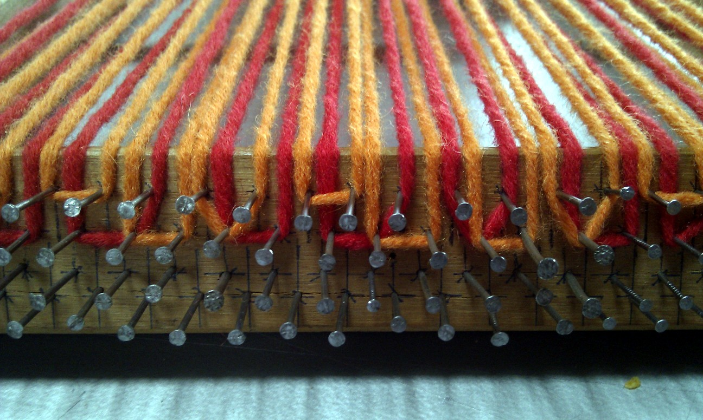
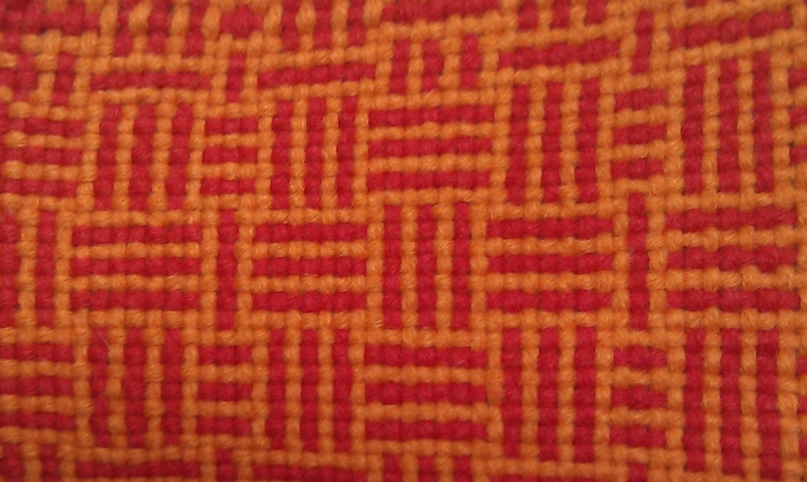

# Understanding plain weave 

Our initial attempt at reaching an understanding of the complexities
of weaving predated the WeavingCodes project and took place during the
Mathematickal arts workshop [http://fo.am/mathematickal_arts/] at Foam
Brussels in 2011. This workshop, with Tim Boykett and textile designer
and educator Carole Collet was devoted to bringing together the arts
of mathematics, textiles and computer programming.

Plain (or tabby) weave is the simplest woven structure, but when
combined with sequences of colour it can produce many different types
of pattern. For example, some of these patterns when combined with
muted colours, have in the past been used as a type of camouflage –
and are classified into District Checks for use in hunting in Lowland
Scotland.

[//]: # (Ref district checks)

It only takes a few lines of code (shown below in the *Scheme*
language) to calculate the colours of a plain weave, using lists of
warp and weft yarn as input.

    ;; return warp or weft, dependent on the position
    (define (stitch x y warp weft)
      ;; a simple way to describe a 2x2 plain weave kernel
      (if (eq? (modulo x 2)
               (modulo y 2))
      warp weft))

    ;; prints out a weaving, picking warp or weft depending on the position
    (define (weave warp weft)
      (for ((x (in-range 0 (length weft))))
         (for ((y (in-range 0 (length warp))))
            (display (stitch x y 
                             (list-ref warp y)
                             (list-ref weft x))))
       (newline)))

With this small computer program we may visualise the weaves with
textual symbols representing different colours. For example, to
specify distinct colours for the warp and weft threads:

`(weave '(O O O O O O O) '(: : : : : : : : :))`

     O : O : O : O
     : O : O : O :
     O : O : O : O
     : O : O : O :
     O : O : O : O
     : O : O : O :
     O : O : O : O
     : O : O : O :
     O : O : O : O

The above simply shows the structure of the warp/weft crossings, with
all warps having a colour represented by `O`, and all wefts by one
represented by `:`. With slightly more complex colourings, we quickly
got a glimpse of the generative possibilities of even plain weave.
For example, 2:2 alternating colour of both warp and weft threads,
with an offset on the weft:

`(weave '(O O : : O O : : O O) '(O : : O O : : O O :))`

     : O : : : O : : : O
     O : : : O : : : O :
     O O O : O O O : O O
     O O : O O O : O O O
     : O : : : O : : : O
     O : : : O : : : O :
     O O O : O O O : O O
     O O : O O O : O O O
     : O : : : O : : : O

This emergence of pattern will be familiar to an experienced weaver,
but a great surprise to a computer programmer. We wanted to explore
these warp/weft thread colour patterns of plain weave further, by
generating them algorithmically. We chose Lindenmayer systems
(L-systems), which are formal grammars originally used to model plant
or cellular growth. L-systems can be related to weaves, in that they
consist of rules which may appear to be simple, but which often
generate complex results which come as a surprise to the
uninitiated. We began with a starting colour (known as an *axiom*),
and then followed two 'search-replace' operations repeatedly,
following the following simple rules:

    Axiom: O
    Rule 1: O => O:O:
    Rule 2: : => :O:

In the above, `=>` simply means search for the symbol on the left, and
replace with the symbols on the right. So, we begin with the axiom:

    O

Then run rule 1 on it - replacing `O` with `O:O:`

    O:O:

Then run rule two, replacing all instances of `:` with `:O:`:

    O:O:O:O:

And repeat both these steps one more time:

    O:O:O:O::O:O:O:O:O::O:O:O:O:O::O:O:O:O:O::O:

This technique allows us to use a very small representation that
expands into a long, complex form. However, our text-based
representation is too simple to really represent how the weave appears
and behaves as a three-dimensional textile, so our next step was to
try weaving these patterns.

We could keep running our rules forever, the string of text will just
keep growing. However, to create a fabric of manageable size we
decided to run them just one more time, then read off the pattern
replacing `O` for red and `:` as orange, to warp a frame loom, shown
in Figure 1. When weaving, we followed the same sequence for the weft
threads, resulting in the textile shown in Figure 2.

There were two motivations behind this approach, firstly to begin to
understand weaving by modelling plain weave, and confirming a
hypothesis (the text version of the pattern) by following instructions
produced by the language by actually weaving them. The other aspect
was to use a generative formal grammar to explore the patterns
possible given the restriction of plain weave, perhaps in a different
manner to that used by weavers -- but one that starts to treat weaving
as a computational medium.

This system was restricted by only working with plain weave, although
given the range of patterns possible, this was not an issue for this
workshop. However the abstract nature of the symbolic modelling was
more of a problem, in future developments we addressed both of these
issues.
