% Textility of Code: A catalogue of errors

# Introduction

<> (removed - this seems beside the point.. could go in intro of the journal issue instead. In the following we explore the notion of code as weave. A challenge for any discussion of coding of weaves is the Jacquard mechanism in machine looms, often recounted as the first meeting point of digital technology and weaving. This is wrong for many reasons, but most crucially, weaving involves the interaction of discrete threads and so has itself always been digital technology since prehistoric times. Furthermore, code involves human enagement with structure, whereas the Jacquard mechanism allows weaves to be considered as two dimensional images, rather than the three dimensional structures which give rise to them.)

Through the following article, we look for different ways to represent
the structure of ancient weaves with contemporary source code.

# Four shaft loom simulation

Instead of defining the pattern you want directly, you are describing
the set up of a 4 shaft loom – so the warp threads that each of 4 shafts
pick up in the top row of toggle boxes, then which shafts are picked up
for each weft thread as the fabric is woven on the right.

This involved writing a program that is based closely on how a loom
functions – for example calculating a shed (the gap between ordered warp
thread) by folding over each shaft in turn and or-ing each warp thread
to calculate which ones are picked up. This really turns out to be the
core of the algorithm – here’s a snippet:

    ;; 'or's two lists together:
    ;; (list-or (list 0 1 1 0) (list 0 0 1 1)) => (list 0 1 1 1)
    (define (list-or a b)
      (map2
       (lambda (a b)
         (if (or (not (zero? a)) (not (zero? b))) 1 0))
       a b))
    
    ;; calculate the shed, given a lift plan position counter
    ;; shed is 0/1 for each warp thread: up/down
    (define (loom-shed l lift-counter)
      (foldl
       (lambda (a b)
         (list-or a b))
       (build-list (length (car (loom-heddles l))) (lambda (a) 0))
       (loom-heddles-raised l lift-counter)))

I’ve become quite obsessed with this program, spending quite a lot of
time with it trying to understand how the loom setup corresponds to the
patterns. Here are some example weaves that you can try. Colour wise, in
all these examples the order is fixed – both the warp and the weft
alternate light/dark yarns.

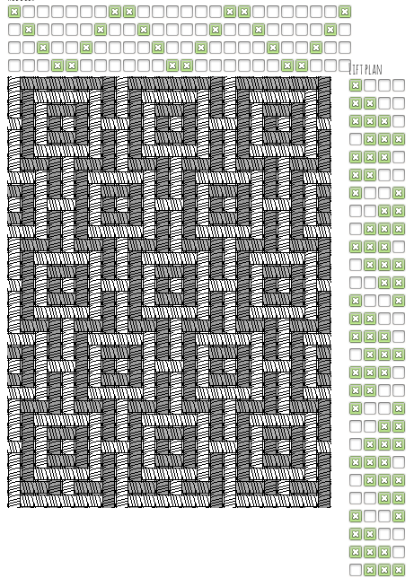

After writing the 4 shaft loom simulation the next job was to try
weaving the structures with real threads. Would I be able to replicate
the predicted patterns and structures? Ellen warned me that the meander
weave would result in unstable fabric, but it would depend on the nature
of the material used so was worth trying. Originally I planned to warp
up the Harris loom but I need to work up to that as it’s a big and
complex job, so I quickly built a frame loom with some bits of wood and
nails at 5mm intervals to hold the warp in place.

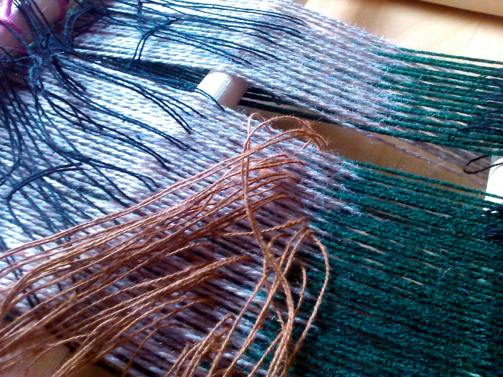

Here I’m sleying the shafts using threads to pick up the warp as defined
by the simulation toggle buttons. The threads (which form heddles) are
tied on to wooden poles which are pulled in different combinations
during weaving. This is the approach we saw on the warp weighted looms
in Copenhagen, I’m not sure if it’s usually used on frame looms – it was
cumbersome but much faster than counting threads manually each
time. It’s important to use thinner threads than the warp, but you need
to put quite a bit of tension on them so they need to be strong. There
is something very appropriate in the context of this project about
coding threads with threads in this way.

In relation to livecoding, I was surprised to the extent that
improvisation is required when weaving even based on a predefined
pattern. There is a lot of reasoning required in response to issues of
structure that cannot be defined ahead of time. You need to respond to
the interactions of the materials and the loom itself, the most obvious
problem you need to think about and solve ‘live’ is the selvedge – the
edges of the fabric. In order to keep the weave from falling apart you
need to ‘tweak’ the first and last warp thread based on which weft yarn
colour thread you are using. The different weft threads also need to go
over/under each other in a suitable manner which interacts with
this. This will be important to include in the simulation properly, but
this will only give an early indication of problematic decisions, rather
than a failsafe solution.

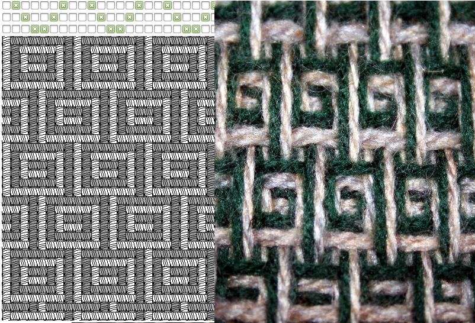

Here’s a closeup of the meander pattern compared to the simulation. The
yarn is cheap and a bit fuzzy, but hopefully you can see the structure –
the differences are interesting. I’m not sure how this will distort
further when I remove it from the loom and the tension is gone.

There are three types of limitation that I’d like to note and think
about (especially in terms of incorporating them in a programming
language). One is the selvedge, as I mentioned earlier – another is
floats, which cause the problems on the meander pattern (long threads
not incorporated into the fabric). The third is more subtle, some
sequences of sheds cause problems when packing down the weft, for
example if you are not too careful you can cause the ordering of the
weft colours to be disrupted in some situations.

- reverse of matrix, input looms state, outputs structure
- colour pattern is side effect of thread rendering order
ee

Represents weaving via the shed operation, rather than a cellular matrix - closer to continuous form
 
Failures
- no selvedge
- floats failure mode not obvious (example meander) 
- impossible warping (double hookup) relies on loom knowledge to get right

# tablet weaving simulation

Tablet weaving is an ancient form of pattern production using cards
which are rotated to provide different sheds between warp threads. It’s
used to produce long strips of fabric, or the starting bands and borders
that form part of a larger warp weighted weaving. We’ll come to the
second use later in the weaving codes project.

After the tablet weaving experiment, here is an attempt at a language/notation for understanding it better. You can have a go here.

Lets start simple:

    (weave-forward 16)

The card rotations are shown on the left for each of the 8 cards, the predicted weaving is on the right for the top and bottom of the fabric. This is setup with a double face weaving on square cards, so black, black, white, white in clockwise from the top right corner. (weave-forward 16) turns all the cards a quarter turn and weaves a weft and repeats this 16 times.

We can offset the cards from each other first to make a pattern. rotate-forward turns only the specified cards a quarter turn forward without weaving a weft (rotate-back also works):

    (rotate-forward 0 1 2 3 4 5)
    (rotate-forward 0 1 2 3)
    (rotate-forward 0 1)
    (weave-forward 32)

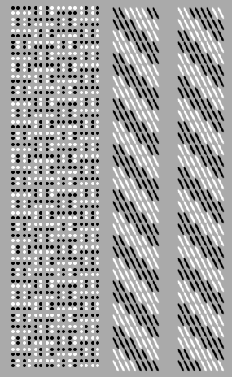

We can’t really weave 32 forward quarter rotates without completely twisting up the warp so lets go forward/back 8 instead to make something physically weavable:

    (rotate-forward 0 1 2 3 4 5)
    (rotate-forward 0 1 2 3)
    (rotate-forward 0 1)
    (repeat 4
      (weave-forward 4)
      (weave-back 4))

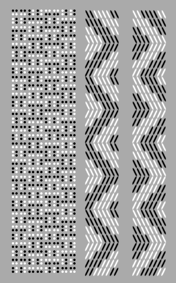

Now we get a zigzag – if we change the starting pattern again:

    (rotate-forward 0 1 2 3 4 5 6)
    (rotate-forward 0 1 2 3 4 5) 
    (rotate-forward 0 1 2 3 4)
    (rotate-forward 0 1 2 3)
    (rotate-forward 0 1 2)
    (rotate-forward 0 1)
    (rotate-forward 0)
    (repeat 4
      (weave-forward 4)
      (weave-back 4))

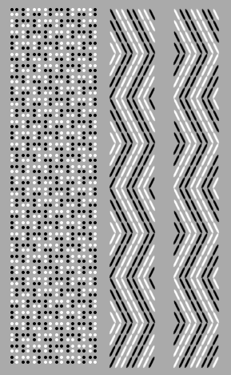

This zigzag matches the stitch direction better. Instead of the rotation offsets we can also use twist, which is more traditional, you can use it to form any pattern. It takes a list of cards to twist, and results in these cards effectively reversing direction compared to the others.

    (weave-forward 7)
    (twist 0 1 2 3)
    (weave-back 1)
    (repeat 2
      (weave-forward 2)
      (weave-back 2))
    (weave-forward 1)
    (twist 2 3 4 5)
    (weave-back 1)
    (repeat 2
      (weave-forward 2)
      (weave-back 2))
    (weave-forward 1)
    (twist 1 2 5 6)
    (weave-back 1)
    (repeat 2
      (weave-forward 2)
      (weave-back 2))

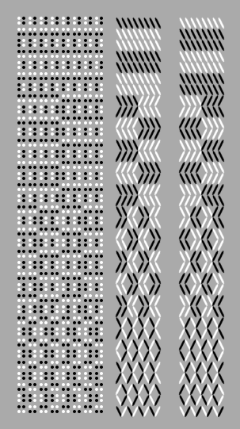

The twist needs to happen when the cards are in the right rotation – if
we repeat this example, but change the first (weave-forward 7) to
(weave-forward 6) we get this instead:

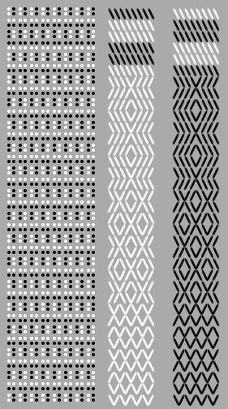

If we put the twists in the loops, we can make small programs with complex results:

    (weave-forward 1)
    (twist 0 2 4 6)
    (repeat 4
      (twist 3)
      (weave-forward 4)
      (twist 5)
      (weave-back 4))

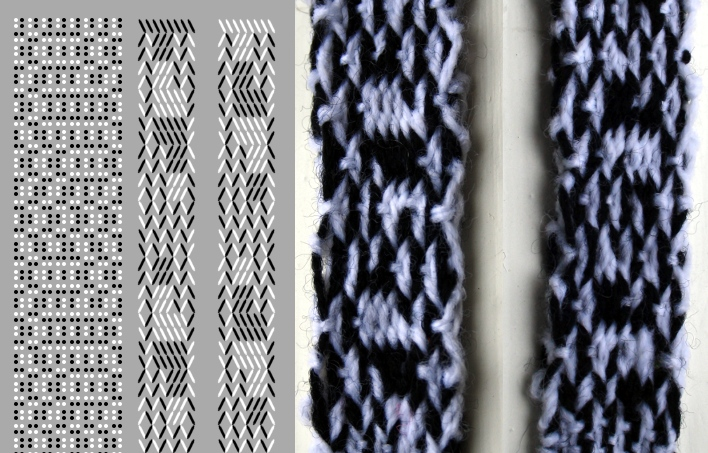
   
Failures:

- can't be combined with warp weighted loom
- doesn't calculate reverse weave properly

# Pattern matrix warp weighted loom simulation

One of the main objectives of the weavecoding project is to provide a
simulation of the warp weighted loom to use for demonstrations and
exploration of ancient weaving techniques. Beyond the 4 shaft loom
dyadic calculator we need to show the actual process of weaving to
explain how the structures and patterns emerge. Weaving is very much a
3D process and these visualisations fail to show that well. It also
needs to be able to be driven by the flotsam tangible livecoding
hardware so running on a Raspberry Pi is another requirement.

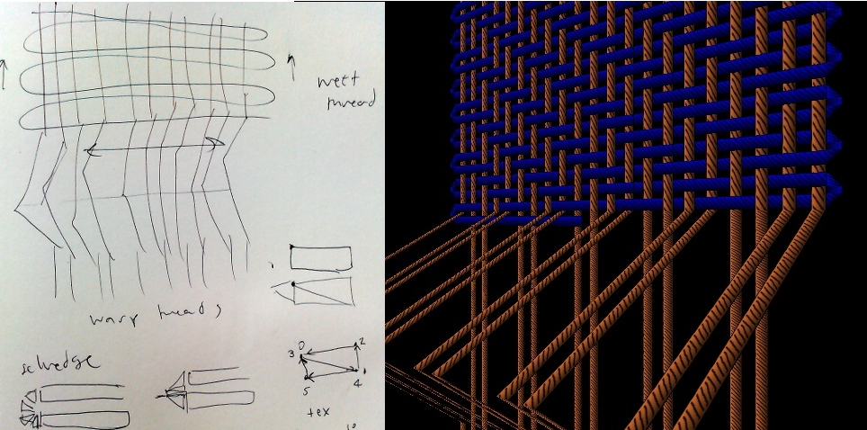

I’ve decided to make use of the Jellyfish procedural renderer to build
something fast and flexible enough, while remaining cross
platform. Jellyfish is a lisp-like language which compiles to a vector
processing virtual machine written in C++, and approaches speeds of
native code (with no garbage collection) while remaining very creative
to work with, similar to fluxus livecoding. Previously I’ve only used it
for small experiments rather than production like this, so I’ve needed
to tighten up the compiler quite a bit. One of the areas which needed
work (along with function arguments which were coming out backwards!)
were the conditional statements, which I removed and replaced with a
single if. Here is the compiler code at the lowest level which emits all
the instructions required:

    ;; compiler code to output a list of instructions for (if pred true-expr false-expr)
    (define (emit-if x)
      (let ((tblock (emit-expr (caddr x))) ;; compile true expression to a block
            (fblock (emit-expr (cadddr x)))) ;; compile false expression to block
        (append
         (emit-expr (cadr x)) ;; predicate - returns true or false
         (emit (vector jmz (+ (length tblock) 2) 0)) ;; if false skip true block
         tblock
         (emit (vector jmr (+ (length fblock) 1) 0)) ;; skip false block
         fblock)))

Then I can implement cond (which is a list of different options to check
rather than one) as a purely syntactic form with a pre-processor
function to create a series of nested ifs before compiling them:

    ;; preprocessor to take a cond list and convert to nested ifs 
    (define (preprocess-cond-to-if x)
      (define (_ l)
        (cond
          ((null? l) 0)          ;; a cond without an else returns 0 
          ((eq? (caar l) 'else)  ;; check for else clause to do
              (cons 'do (pre-process (cdr (car l)))))
          (else (list 'if (pre-process (caar l)) ;; build an if
              (cons 'do (pre-process (cdr (car l))))
                      (_ (cdr l)))))) ;; keep going
      (_ (cdr x))) ;; ignores the 'cond'

Here’s an example of the if in use in the loom simulation at the ‘top’
level – it gets the current weaving draft value for the weft and warp
thread position and uses it to move the weft polygons forward or back
(in the z) a tiny amount to show up on the correct side of the warp.

    (define calc-weft-z
        (lambda ()
            (set! weft-count (+ weft-count 1))
            (set! weft-z
                  (if (> (read-draft) 0.5)
                      (vector 0 0 0.01)
                      (vector 0 0 -0.01)))))

One of the reasons I’m writing about all these levels of representation
is that they feel close to the multiple representations present in
weaving from draft to heddle layout, lift plan, fabric structure and
resulting pattern.

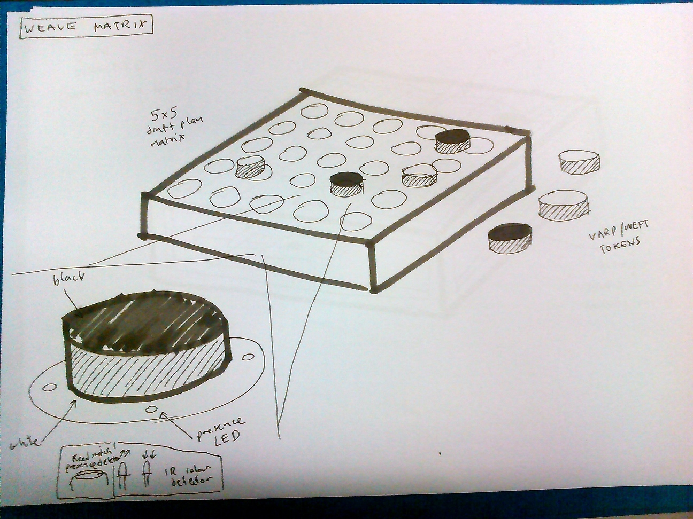

We’re starting construction of version 2 of the flotsam tangible
programming device, specialised to weaving – and henceforth known as the
‘pattern matrix’. This will be tested during May at our upcoming
performance/workshop/residency at Munich’s Museum für Abgüsse
Klassischer Bildwerke (Museum of Casts of Classical Sculpture) with the
Coding weaves project, and then for later use in Cornwall (more on that
part soon).

The first thing we are exploring is removing the need for physical plugs
– although I like them a lot, they are problematic for people as it
takes time to learn how to align the blocks in the current prototype. In
order to get around this, and maintain the cheapness of the programming
blocks themselves we’re looking at using magnetism to represent
information. We can use blocks with no connections, painted white and
black on different sides and detect their orientation and position via a
magnet in the centre.

Initially this idea came from thinking about reed switches with
Francesca, and playing with mobile phone magnetometers on the UAV
project led to us investigating Hall effect sensors (the building blocks
of magnetometers). We had a bit of a testing workshop with Andy from the
Falmouth University makernow fablab who are helping with construction of
this project.

Hall effect sensors allow us to detect the polarity of nearby magnetic fields – and seem to be restricted enough in range that they can be very precise. Even with fairly weak magnets we found we could put the sensors right next to each other (see above) and still determine the difference between two opposed or aligned fields.

For the warp/weft weave pattern structure we only need 1 bit of information to be detected, but for future extensibility for the yarn colour programming setup it’s important to be able to read more (4 bits are encoded in the flotsam blocks).

Our plan is to try putting 4 sensors in a square which adds an intriguing possibility of rotating the blocks to change their meaning, as well as flipping them. The great thing is that this gets very close to tablet weaving in terms of the notation and the actions required. We can also represent all 16 states with only 4 blocks – if negative is 0 and positive is 1, and we read the code as binary clockwise from top left:

Starting state [0,1,5,6]
- -   + -   + -   - +
- -   - -   - +   - +

Rotate clockwise [0,2,10,12]
- -   - +   - +   - - 
- -   - -   + -   + +

Horizontal flip [15,11,10,12]
+ +   + +   - +   - - 
+ +   + -   + -   + +

Rotate counter-clockwise [15,13,5,6]
+ +   + -   + -   - + 
+ +   + +   - +   - +

Vertical flip [0,4,5,6]
- -   - -   + -   - + 
- -   - +   - +   - +

Here is Andy’s design for the PCB we’ll use under each of the 25 board locations:

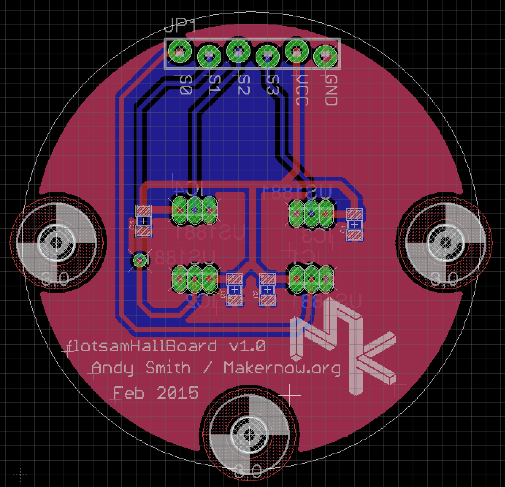

Here is a member of staff at Miners Court trying some tangible weave
coding in the midst of our crafts area – at the moment it’s simply
displaying the weave structure on the simulated warp weighed loom with a
single colour each for warp and weft threads, the next thing is to get
‘colour & weave’ patterns working.

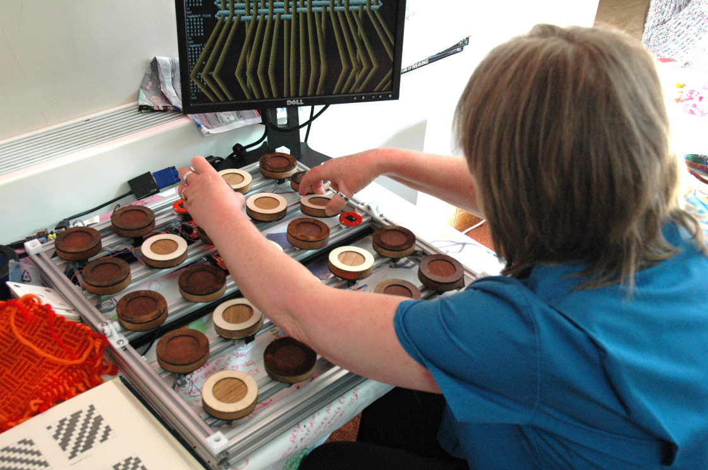

The pattern matrix is the second generation of tangible programming
device from the weavecoding project. It’s been built as an open hardware
project in collaboration with Falmouth University’s Makernow fablab, who
have designed and built the chassis using many 3D printed parts and
assembled the electronics using surface mount components (far beyond my
stripboard skills).

Here you can see the aluminium framework supporting the AVR based row
controller boards with the Raspberry Pi in the corner. The hall effect
sensors detect magnetic fields – this picture was taken before any of
the wiring was started.

IMG_20150408_105446

The row controllers are designed to read the sensor data and dispatch it
to the Raspberry Pi using i2c serial communication running on their
atmega328 processors. This design was arrived at after the experience of
building flotsam which centralised all of the logic in the Raspberry Pi,
resulting in lots of wiring required to collect the 128 bits of
information and pass it to the GPIO port on the Pi. Using i2c has the
advantage that you only need two wires to communicate everything,
processing can be distributed and it can be far more modular and
extendible in future. In fact we plan to try different sensors and
configurations – so this is a great platform for experimenting with
tangible programming.

This video shows the current operation of the sensors and row
controllers, I’ve programmed the board with test code that displays the
state of the magnetic field with the status LED, making sure that it can
tell the orientation of the programming block:

The row controllers have a set of multiplexers that allow you to choose
between 20 sensor inputs all routed to an analogue pin on the AVR. We’re
just using digital here, but it means we can try totally different
combinations of sensors without changing the rest of the hardware.

After getting the first couple of rows working and testing it with
elderly people at our Miners Court residency there were a couple of
issues. Firstly the magnets were really strong, and I worried about
leaving it unattended with the programming blocks snapping together so
violently (as we plan to use it in museum settings as well as at Miners
Court). The other problem was that even with strong magnets, the
placement of the blocks needed to be very precise. This is probably to
do with the shape of the magnets, and the fact that the fields bend
around them and reverse quite short distances from their edges.

To fix these bugs it was a fairly simple matter to take the blocks
apart, remove 2 of the 3 magnets and add some rings to guide placement
over the sensors properly:

IMG_20150418_114347

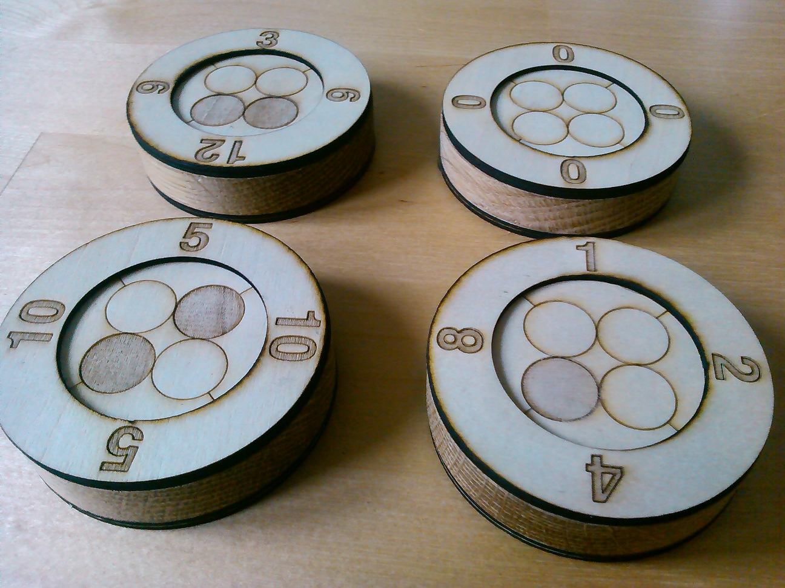

When we started designing the pattern matrix we wanted to include the
possibility of encoding more than binary (which side is up) using the
magnets. In order to test this, we made the bottom row of sensors with 4
in a square – the rest only have one sensor currently (to avoid blowing
the budget on hall effect sensors).

The 4 bit binary codes read in clockwise order from the top left (same
as the notation for tablet weaving) so rotation causes the same effect
as bitwise rotate in programming – multiply/divide by 2 with
overflow. There are 4 possible different configurations of magnets
(which can provide block identification). Two of the configurations are
mirrored on both sides but you can read rotation still, with the other
two you also can tell which side is up, and one – bottom left in the
photo below, can represent 8 states all by itself (flip as well as
rotate).

first attempt at including selvedge

uses 'jellyfish', a language compiled to bytecode for procedural 3D rendering

more tangible thoughts... magnets...

continous weft threads (multiple in the case of complex colour pattern) weave over/under straight warp threads

multiple weft threads/selvedge combination points towards a need to encode these properly

Failures

- threads are 2 dimensional ribbons
- reads from a matrix
- complexity in selvedge calculation

# Toothpaste

We’ve been working on new approaches to 3D rendering ancient weaves,
using Alex’s new behavioural language (which describes a weave from the
perspective of a single thread) as the description for our
modelling. This new approach allows us to build a fabric out of a single
geometric shape, where warp and weft are part of the same thread.

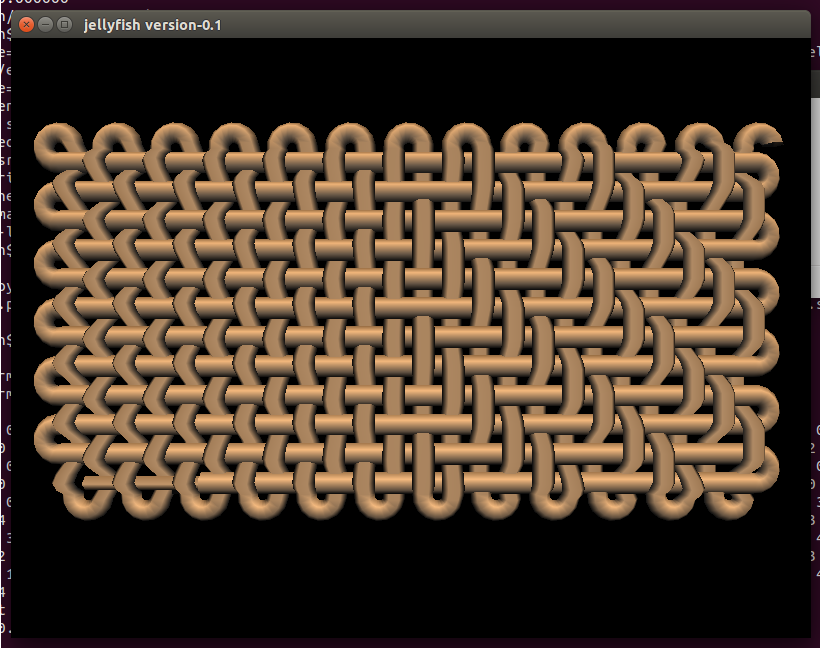

This is mix of tabby and 2:2 twill, created by this code:

warp 12 24 ++ [TurnIn] ++ threadWeftBy'' Odd (rot 3) ([Over,Under]) 12
12 ++ threadWeftBy'' Odd (rot 3) ([Over,Over,Under,Under]) 12 12

I’m still learning this language, but more on that soon. This line
produces an large list of instructions the weave renderer uses to build
it’s model, turning the thread and shifting it up and down as it crosses
itself.

In the video in his last post Alex describes using this to mix two
separate weaving techniques together, which is one of our main reasons
for developing this language – existing weave simulations cannot
replicate the weaving technology of the ancient Greeks who for example,
combined tablet and warp weighted weaving in the same fabric.

The second problem with weave simulations is shown by the following
screenshot from a popular existing system:

Fabrics modelled in this way are considered to infinitely repeating
sections with chopped off threads. There is no consideration for the
selvedge at the edge of the fabric – which as we’ve shown in our past
research is almost like a completely separate weave system of it’s own,
and rarely considered by notation systems or modelling (and often left
to the weaver to ‘livecode’). Here is a different view of the same
fabric:

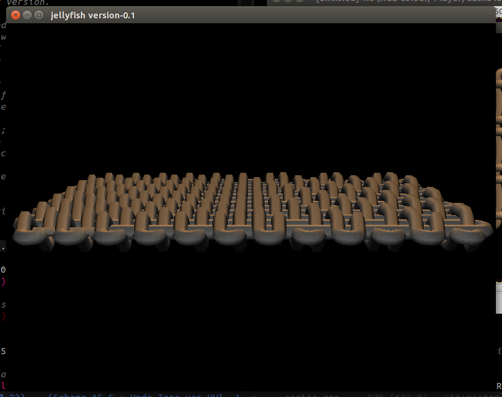

We can also now introduce other changes to the yarn structure, for
example modifying the width using a sine wave.

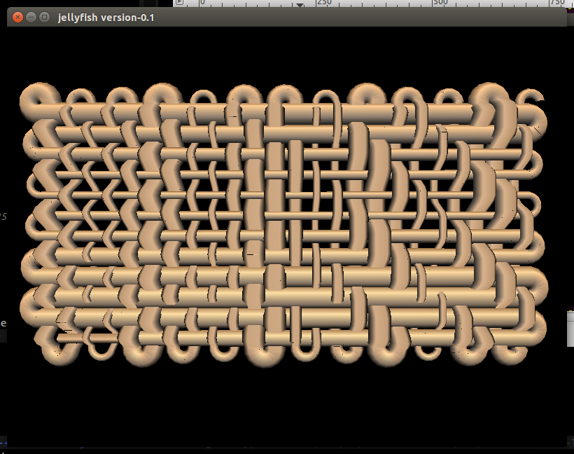

I still have a few glitches to fix as you can see above, but here is a
video of the development process from the first script, getting the
polygons lined up, fixing the turning, adding over/under, reading Alex’s
code and finally lining everything up.

Extruding a profile according to instructions stored in texture coordinate memory, reading from behaviour language

            ;; advance position
            (set! pos (+ pos dir))
            ;; update direction with current rotation matrix
            (set! dir (tx-proj (addr cur-tx-a) (vector 1 0 0)))
            ;; read current sequence
            (set! seq-cur (read (+ seq-pos texture-start)))
            (cond
             ((eq? seq-cur 0)
              (init-mat)
              (trace dir)
              (set! pos (+ pos (* dir (- segments 1))))
              (set! t segments)
              )
             ((eq? seq-cur 1) (rotate-mat-y (/ 90 segments)))
             ((eq? seq-cur 2) (rotate-mat-y (/ -90 segments)))
             ((eq? seq-cur 3)
              (set! pos
                    (+ pos (*v (sincos (* (/ t (- segments 1)) 180))
                               (vector 0 1 0)))))
             ((eq? seq-cur 4)
              (set! pos
                    (+ pos (*v (sincos (* (/ t (- segments 1)) 180))
                               (vector 0 -1 0)))))
              )

            ;; apply to current
            (*m (addr tx-a) (addr cur-tx-a) (addr cur-tx-a))

Citation test \cite{Cocker_2013}
