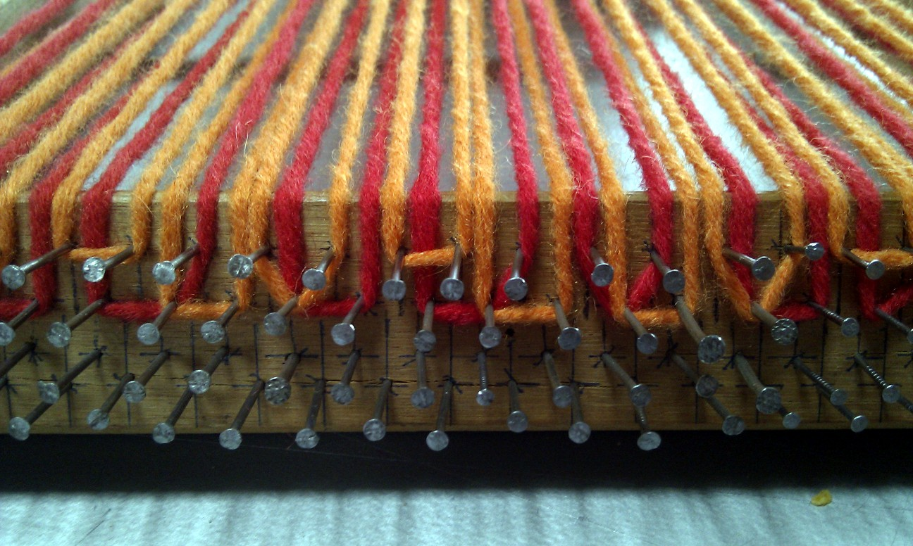
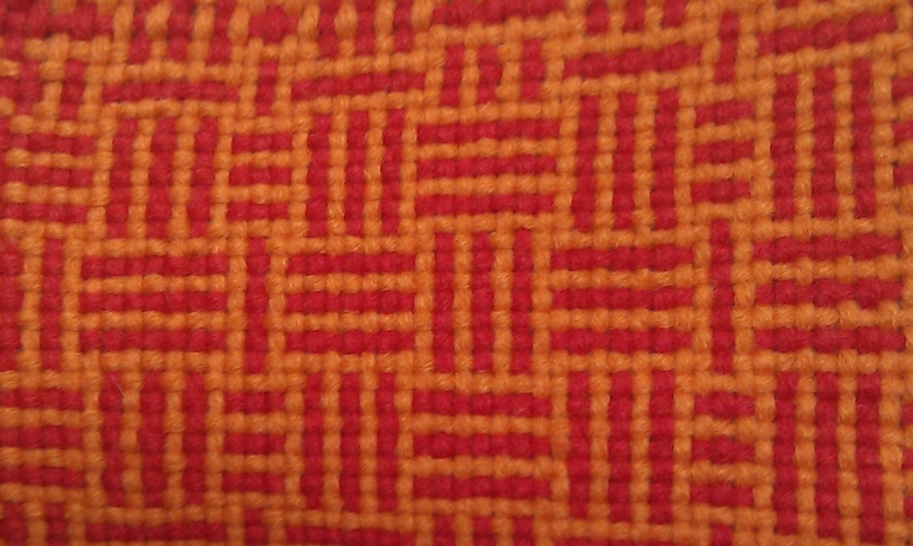

% Textility of Code: A catalogue of errors

# Introduction

In the following we explore the notion of code as weave. A challenge
for any discussion of coding of weaves is the Jacquard mechanism in
machine looms, often recounted as the first meeting point of digital
technology and weaving. This is wrong for many reasons, but most
crucially, weaving involves the interaction of discrete threads and so
has itself always been digital technology since prehistoric times.
Further more code involves human enagement with structure, whereas the
Jacquard mechanism allows weaves to be considered as two dimensional
images, rather than the three dimensional structures which give rise
to them.

Through the following chapter, we find that patterns are at the very
basis of computation, and that the punch cards of the Jacquard
mechanism are just one manifestation of this.

# Dyadic arithmetic

# Mathematickal arts workshop (foam brussels)

Plain or tabby weave is the simplest form of weaving, but when combined
with sequences of colour it can produce many different types of pattern.

Some of these patterns when combined with muted colours, have in the
past been used as a type of camouflage – and are classified into
District Checks[] for use in hunting in Lowland Scotland. 

A few lines of Scheme calculate and print the colours of an arbitrarily
sized weave, by using lists of warp and weft as input.

    ; return warp or weft, dependant on the position
    (define (stitch x y warp weft)
      (if (eq? (modulo x 2)
               (modulo y 2))
      warp weft))

    ; prints out a weaving
    (define (weave warp weft)
      (for ((x (in-range 0 (length weft))))
         (for ((y (in-range 0 (length warp))))
            (display (stitch x y 
                             (list-ref warp y)
                             (list-ref weft x))))
       (newline)))

We can visualising the weaves with single characters representing
colours for ascii previewing, here are some examples:

`(weave '(O O O O O O O) '(: : : : : : : : :))`

     O : O : O : O
     : O : O : O :
     O : O : O : O
     : O : O : O :
     O : O : O : O
     : O : O : O :
     O : O : O : O
     : O : O : O :
     O : O : O : O

`(weave '(O O : : O O : : O O) '(O : : O O : : O O :))`

     : O : : : O : : : O
     O : : : O : : : O :
     O O O : O O O : O O
     O O : O O O : O O O
     : O : : : O : : : O
     O : : : O : : : O :
     O O O : O O O : O O
     O O : O O O : O O O
     : O : : : O : : : O

This looked quite promising as ascii art, but I didn’t really know how
it would translate into a textile. I also wanted to look into ways of
generating new patterns algorithmically, using formal grammars. The idea
is that you begin with an axiom, or starting state, and do a 'search
replace' on it repeatedly following one or more simple rules:

Axiom: O
Rule 1: O => O : O :
Rule 2: : => : O :
Run for 3 generations

This technique draws comparisons with Jacquard looms, but obviously it’s
far simpler as the weave itself is the same, we are only changing
between 2 colours (and a human is very much required to do the weaving
in this case). 

Failures: 
- no kernel matrix
- no selvedge

# flotsam raspberry pi simulation

Flotsam is a prototype screenless tangible programming language largely
built from driftwood. It is a declarative style L system for describing
weave structure and pattern with yarn width and colour. The LEDs
indicate that the evaluation happens simultaneously, as this is a
functional language. The blocks represent blue and pink yarn in two
widths, with rules to produce the warp/weft sequence based on the rows
the blocks are positioned on:

The weaving simulation is written in pygame, and is deliberately
designed to make alternative weave structures than those possible with
Jacquard looms by including yarn properties. The version in the video is
plain weave, but more complex structures can be defined as below – in
the same way as Alex’s gibber software:

    # return warp or weft, dependant on the position
    def stitch(self, x, y, warp, weft):
        #if x % 2 == y % 2:
        if self.structure[x%self.width+(y%self.height)*self.width]==1:
            return warp
        else:
            return weft

self.structure is an array width*height that determines the pattern
structure can be read from block pattern in tangible hardware or preset
with tangible hardware controlling the colour sequence

Failures
- tangible hardware (lsystem) not representing how weavers think
- visualisation is cellular rather than representing continuous thread

# Dyadic browser weaving
compiled scheme code and rendering based on camouflage pattern research
\cite{4dfb7697-399b-4aed-aac9-4a5b1e40677d} \cite{1e5bb01b-81de-4c67-9664-eee0cf0b5c31}

# Four shaft loom simulation

Instead of defining the pattern you want directly, you are describing
the set up of a 4 shaft loom – so the warp threads that each of 4 shafts
pick up in the top row of toggle boxes, then which shafts are picked up
for each weft thread as the fabric is woven on the right.

This involved writing a program that is based closely on how a loom
functions – for example calculating a shed (the gap between ordered warp
thread) by folding over each shaft in turn and or-ing each warp thread
to calculate which ones are picked up. This really turns out to be the
core of the algorithm – here’s a snippet:

    ;; 'or's two lists together:
    ;; (list-or (list 0 1 1 0) (list 0 0 1 1)) => (list 0 1 1 1)
    (define (list-or a b)
      (map2
       (lambda (a b)
         (if (or (not (zero? a)) (not (zero? b))) 1 0))
       a b))
    
    ;; calculate the shed, given a lift plan position counter
    ;; shed is 0/1 for each warp thread: up/down
    (define (loom-shed l lift-counter)
      (foldl
       (lambda (a b)
         (list-or a b))
       (build-list (length (car (loom-heddles l))) (lambda (a) 0))
       (loom-heddles-raised l lift-counter)))

I’ve become quite obsessed with this program, spending quite a lot of
time with it trying to understand how the loom setup corresponds to the
patterns. Here are some example weaves that you can try. Colour wise, in
all these examples the order is fixed – both the warp and the weft
alternate light/dark yarns.

After writing the 4 shaft loom simulation the next job was to try
weaving the structures with real threads. Would I be able to replicate
the predicted patterns and structures? Ellen warned me that the meander
weave would result in unstable fabric, but it would depend on the nature
of the material used so was worth trying. Originally I planned to warp
up the Harris loom but I need to work up to that as it’s a big and
complex job, so I quickly built a frame loom with some bits of wood and
nails at 5mm intervals to hold the warp in place.

Here I’m sleying the shafts using threads to pick up the warp as defined
by the simulation toggle buttons. The threads (which form heddles) are
tied on to wooden poles which are pulled in different combinations
during weaving. This is the approach we saw on the warp weighted looms
in Copenhagen, I’m not sure if it’s usually used on frame looms – it was
cumbersome but much faster than counting threads manually each
time. It’s important to use thinner threads than the warp, but you need
to put quite a bit of tension on them so they need to be strong. There
is something very appropriate in the context of this project about
coding threads with threads in this way.

In relation to livecoding, I was surprised to the extent that
improvisation is required when weaving even based on a predefined
pattern. There is a lot of reasoning required in response to issues of
structure that cannot be defined ahead of time. You need to respond to
the interactions of the materials and the loom itself, the most obvious
problem you need to think about and solve ‘live’ is the selvedge – the
edges of the fabric. In order to keep the weave from falling apart you
need to ‘tweak’ the first and last warp thread based on which weft yarn
colour thread you are using. The different weft threads also need to go
over/under each other in a suitable manner which interacts with
this. This will be important to include in the simulation properly, but
this will only give an early indication of problematic decisions, rather
than a failsafe solution.

Here’s a closeup of the meander pattern compared to the simulation. The
yarn is cheap and a bit fuzzy, but hopefully you can see the structure –
the differences are interesting. I’m not sure how this will distort
further when I remove it from the loom and the tension is gone.

There are three types of limitation that I’d like to note and think
about (especially in terms of incorporating them in a programming
language). One is the selvedge, as I mentioned earlier – another is
floats, which cause the problems on the meander pattern (long threads
not incorporated into the fabric). The third is more subtle, some
sequences of sheds cause problems when packing down the weft, for
example if you are not too careful you can cause the ordering of the
weft colours to be disrupted in some situations.

- reverse of matrix, input looms state, outputs structure
- colour pattern is side effect of thread rendering order
ee

Represents weaving via the shed operation, rather than a cellular matrix - closer to continuous form
 
Failures
- no selvedge
- floats failure mode not obvious (example meander) 
- impossible warping (double hookup) relies on loom knowledge to get right

# tablet weaving simulation

Tablet weaving is an ancient form of pattern production using cards
which are rotated to provide different sheds between warp threads. It’s
used to produce long strips of fabric, or the starting bands and borders
that form part of a larger warp weighted weaving. We’ll come to the
second use later in the weaving codes project.

After the tablet weaving experiment, here is an attempt at a language/notation for understanding it better. You can have a go here.

Lets start simple:

    (weave-forward 16)

The card rotations are shown on the left for each of the 8 cards, the predicted weaving is on the right for the top and bottom of the fabric. This is setup with a double face weaving on square cards, so black, black, white, white in clockwise from the top right corner. (weave-forward 16) turns all the cards a quarter turn and weaves a weft and repeats this 16 times.

We can offset the cards from each other first to make a pattern. rotate-forward turns only the specified cards a quarter turn forward without weaving a weft (rotate-back also works):

    (rotate-forward 0 1 2 3 4 5)
    (rotate-forward 0 1 2 3)
    (rotate-forward 0 1)
    (weave-forward 32)

We can’t really weave 32 forward quarter rotates without completely twisting up the warp so lets go forward/back 8 instead to make something physically weavable:

    (rotate-forward 0 1 2 3 4 5)
    (rotate-forward 0 1 2 3)
    (rotate-forward 0 1)
    (repeat 4
      (weave-forward 4)
      (weave-back 4))

Now we get a zigzag – if we change the starting pattern again:

    (rotate-forward 0 1 2 3 4 5 6)
    (rotate-forward 0 1 2 3 4 5) 
    (rotate-forward 0 1 2 3 4)
    (rotate-forward 0 1 2 3)
    (rotate-forward 0 1 2)
    (rotate-forward 0 1)
    (rotate-forward 0)
    (repeat 4
      (weave-forward 4)
      (weave-back 4))

This zigzag matches the stitch direction better. Instead of the rotation offsets we can also use twist, which is more traditional, you can use it to form any pattern. It takes a list of cards to twist, and results in these cards effectively reversing direction compared to the others.

    (weave-forward 7)
    (twist 0 1 2 3)
    (weave-back 1)
    (repeat 2
      (weave-forward 2)
      (weave-back 2))
    (weave-forward 1)
    (twist 2 3 4 5)
    (weave-back 1)
    (repeat 2
      (weave-forward 2)
      (weave-back 2))
    (weave-forward 1)
    (twist 1 2 5 6)
    (weave-back 1)
    (repeat 2
      (weave-forward 2)
      (weave-back 2))

The twist needs to happen when the cards are in the right rotation – if
we repeat this example, but change the first (weave-forward 7) to
(weave-forward 6) we get this instead:

If we put the twists in the loops, we can make small programs with complex results:

    (weave-forward 1)
    (twist 0 2 4 6)
    (repeat 4
      (twist 3)
      (weave-forward 4)
      (twist 5)
      (weave-back 4))

   
Failures:

- can't be combined with warp weighted loom
- doesn't calculate reverse weave properly

# Pattern matrix warp weighted loom simulation

first attempt at including selvedge

uses 'jellyfish', a language compiled to bytecode for procedural 3D rendering

more tangible thoughts... magnets...

continous weft threads (multiple in the case of complex colour pattern) weave over/under straight warp threads

            (when (eq? weaving 1)
                  (calc-weft-z)
                  (set! weft-position (+ weft-position weft-direction))

                  ;; selvedge time?
                  (cond
                   ((> weft-count weft-total)
                    (set! weft-count 0)
                    (set! weft-position (- (+ weft-position selvedge-gap)
                                           weft-direction))
                    (set! weft-direction (* weft-direction -1))
                    (if (> 0 weft-direction)
                        (right-selvedge selvedge-gap)
                        (left-selvedge selvedge-gap))
                    (set! weaving 0)
                    (set! weft-position (- weft-position weft-direction)))
                   (else
                    (write! vertex
                            (+ weft-z weft-position)
                            (+ weft-position (+ weft-z (vector 2 1.3 0)))
                            (+ weft-position (+ weft-z (vector 2 0 0)))
                            (+ weft-z weft-position)
                            (+ weft-position (+ weft-z (vector 2 1.3 0)))
                            (+ weft-position (+ weft-z (vector 0 1.3 0))))
                    (set! vertex (+ vertex 6)))))

multiple weft threads/selvedge combination points towards a need to encode these properly

Failures

- threads are 2 dimensional ribbons
- reads from a matrix
- complexity in selvedge calculation

# Toothpaste

Extruding a profile according to instructions stored in texture coordinate memory, reading from behaviour language

            ;; advance position
            (set! pos (+ pos dir))
            ;; update direction with current rotation matrix
            (set! dir (tx-proj (addr cur-tx-a) (vector 1 0 0)))
            ;; read current sequence
            (set! seq-cur (read (+ seq-pos texture-start)))
            (cond
             ((eq? seq-cur 0)
              (init-mat)
              (trace dir)
              (set! pos (+ pos (* dir (- segments 1))))
              (set! t segments)
              )
             ((eq? seq-cur 1) (rotate-mat-y (/ 90 segments)))
             ((eq? seq-cur 2) (rotate-mat-y (/ -90 segments)))
             ((eq? seq-cur 3)
              (set! pos
                    (+ pos (*v (sincos (* (/ t (- segments 1)) 180))
                               (vector 0 1 0)))))
             ((eq? seq-cur 4)
              (set! pos
                    (+ pos (*v (sincos (* (/ t (- segments 1)) 180))
                               (vector 0 -1 0)))))
              )

            ;; apply to current
            (*m (addr tx-a) (addr cur-tx-a) (addr cur-tx-a))

Citation test \cite{Cocker_2013}
