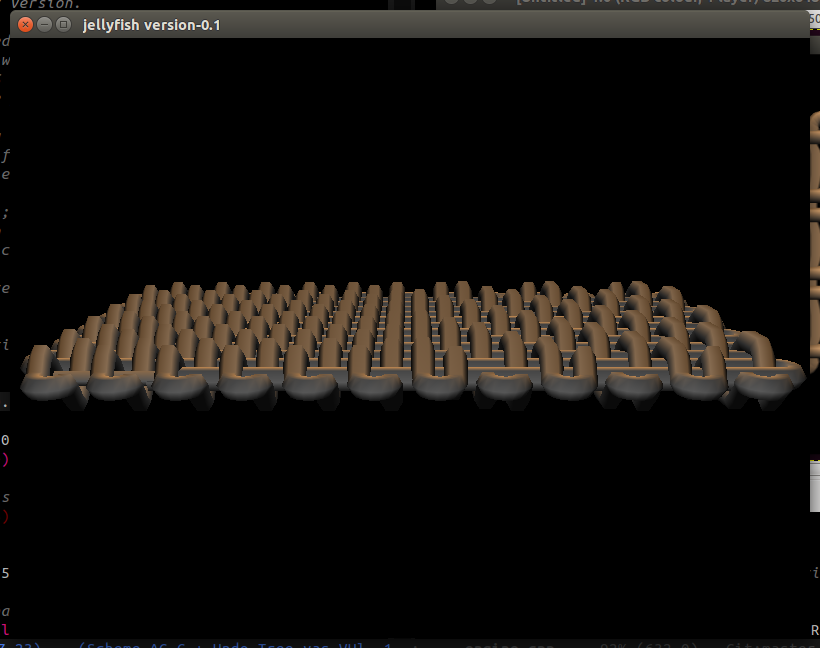
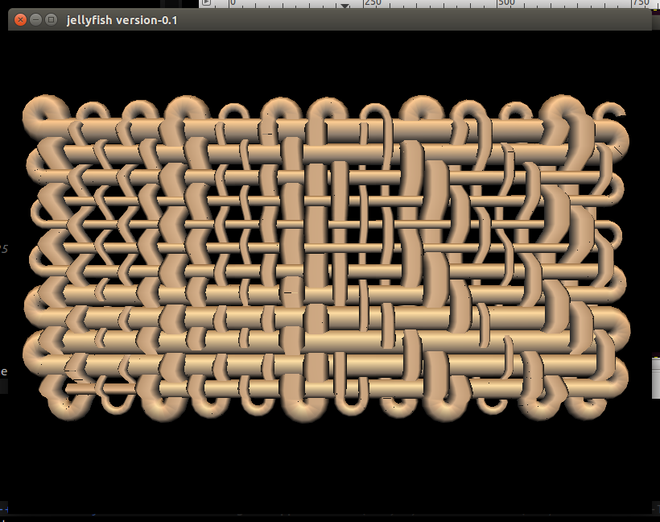

# Toothpaste

The 'toothpaste' approach to weave simulation was the result of both
working with the 3D selvedge calculation with the warp weighted loom
model, and wanting a more general approach to modelling that could
eventually be expanded to include the double twining of tablet
weaving. This will enable us to finally represent the ancient technique
of combining different weaving technologies into one fabric.

It is designed to be driven by our single thread notation system, which
frees us from concepts of the loom, weaver or even warp and weft.

This example is mix of tabby and 2:2 twill, created by this code:

    warp 12 24 ++ [TurnIn] ++ threadWeftBy'' Odd (rot 3) ([Over,Under]) 12 12 ++ threadWeftBy'' Odd (rot 3) ([Over,Over,Under,Under]) 12 12

This line of code produces a large list of instructions the weave
renderer uses to build the model, turning the thread and shifting it up
and down as it crosses itself.

Here is a different view of the same fabric to show the selvedge:

We can also now easily introduce other changes to the yarn structure,
for example modifying the width along the length of the thread.

