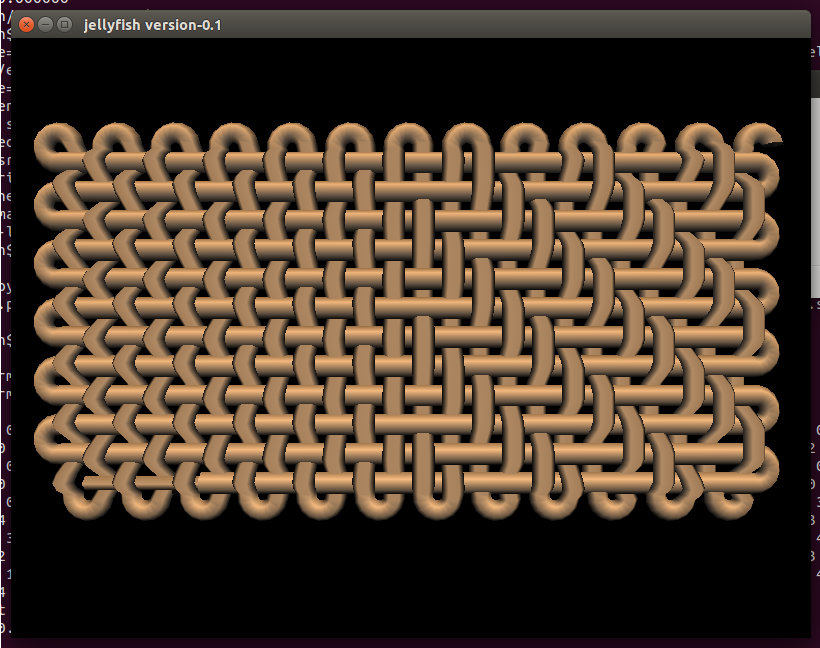

# Toothpaste

We’ve been working on new approaches to 3D rendering ancient weaves,
using Alex’s new behavioural language (which describes a weave from the
perspective of a single thread) as the description for our
modelling. This new approach allows us to build a fabric out of a single
geometric shape, where warp and weft are part of the same thread.

This is mix of tabby and 2:2 twill, created by this code:

warp 12 24 ++ [TurnIn] ++ threadWeftBy'' Odd (rot 3) ([Over,Under]) 12
12 ++ threadWeftBy'' Odd (rot 3) ([Over,Over,Under,Under]) 12 12

I’m still learning this language, but more on that soon. This line
produces an large list of instructions the weave renderer uses to build
it’s model, turning the thread and shifting it up and down as it crosses
itself.

In the video in his last post Alex describes using this to mix two
separate weaving techniques together, which is one of our main reasons
for developing this language – existing weave simulations cannot
replicate the weaving technology of the ancient Greeks who for example,
combined tablet and warp weighted weaving in the same fabric.

The second problem with weave simulations is shown by the following
screenshot from a popular existing system:

Fabrics modelled in this way are considered to infinitely repeating
sections with chopped off threads. There is no consideration for the
selvedge at the edge of the fabric – which as we’ve shown in our past
research is almost like a completely separate weave system of it’s own,
and rarely considered by notation systems or modelling (and often left
to the weaver to ‘livecode’). Here is a different view of the same
fabric:

We can also now introduce other changes to the yarn structure, for
example modifying the width using a sine wave.

I still have a few glitches to fix as you can see above, but here is a
video of the development process from the first script, getting the
polygons lined up, fixing the turning, adding over/under, reading Alex’s
code and finally lining everything up.

Extruding a profile according to instructions stored in texture coordinate memory, reading from behaviour language

            ;; advance position
            (set! pos (+ pos dir))
            ;; update direction with current rotation matrix
            (set! dir (tx-proj (addr cur-tx-a) (vector 1 0 0)))
            ;; read current sequence
            (set! seq-cur (read (+ seq-pos texture-start)))
            (cond
             ((eq? seq-cur 0)
              (init-mat)
              (trace dir)
              (set! pos (+ pos (* dir (- segments 1))))
              (set! t segments)
              )
             ((eq? seq-cur 1) (rotate-mat-y (/ 90 segments)))
             ((eq? seq-cur 2) (rotate-mat-y (/ -90 segments)))
             ((eq? seq-cur 3)
              (set! pos
                    (+ pos (*v (sincos (* (/ t (- segments 1)) 180))
                               (vector 0 1 0)))))
             ((eq? seq-cur 4)
              (set! pos
                    (+ pos (*v (sincos (* (/ t (- segments 1)) 180))
                               (vector 0 -1 0)))))
              )

            ;; apply to current
            (*m (addr tx-a) (addr cur-tx-a) (addr cur-tx-a))

