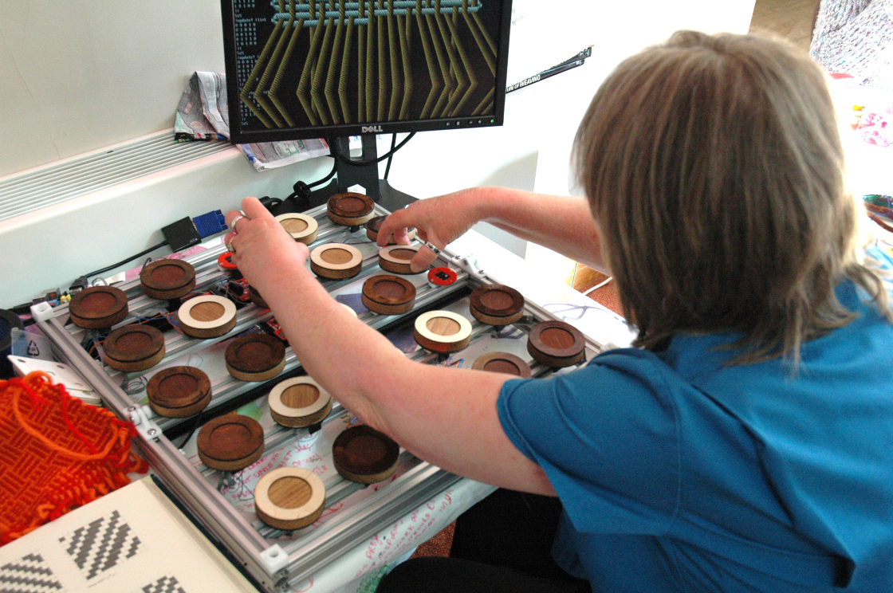

# Pattern matrix warp weighted loom simulation

One of the main objectives of the weavecoding project is to provide a
simulation of the warp weighted loom to use for demonstrations and
exploration of ancient weaving techniques. Beyond the 4 shaft loom
dyadic calculator we need to show the actual process of weaving to
explain how the structures and patterns emerge. Weaving is very much a
3D process and these visualisations fail to show that well. It also
needs to be able to be driven by the flotsam tangible livecoding
hardware so running on a Raspberry Pi is another requirement.

I’ve decided to make use of the Jellyfish procedural renderer to build
something fast and flexible enough, while remaining cross
platform. Jellyfish is a lisp-like language which compiles to a vector
processing virtual machine written in C++, and approaches speeds of
native code (with no garbage collection) while remaining very creative
to work with, similar to fluxus livecoding. Previously I’ve only used it
for small experiments rather than production like this, so I’ve needed
to tighten up the compiler quite a bit. One of the areas which needed
work (along with function arguments which were coming out backwards!)
were the conditional statements, which I removed and replaced with a
single if. Here is the compiler code at the lowest level which emits all
the instructions required:

    ;; compiler code to output a list of instructions for (if pred true-expr false-expr)
    (define (emit-if x)
      (let ((tblock (emit-expr (caddr x))) ;; compile true expression to a block
            (fblock (emit-expr (cadddr x)))) ;; compile false expression to block
        (append
         (emit-expr (cadr x)) ;; predicate - returns true or false
         (emit (vector jmz (+ (length tblock) 2) 0)) ;; if false skip true block
         tblock
         (emit (vector jmr (+ (length fblock) 1) 0)) ;; skip false block
         fblock)))

Then I can implement cond (which is a list of different options to check
rather than one) as a purely syntactic form with a pre-processor
function to create a series of nested ifs before compiling them:

    ;; preprocessor to take a cond list and convert to nested ifs 
    (define (preprocess-cond-to-if x)
      (define (_ l)
        (cond
          ((null? l) 0)          ;; a cond without an else returns 0 
          ((eq? (caar l) 'else)  ;; check for else clause to do
              (cons 'do (pre-process (cdr (car l)))))
          (else (list 'if (pre-process (caar l)) ;; build an if
              (cons 'do (pre-process (cdr (car l))))
                      (_ (cdr l)))))) ;; keep going
      (_ (cdr x))) ;; ignores the 'cond'

Here’s an example of the if in use in the loom simulation at the ‘top’
level – it gets the current weaving draft value for the weft and warp
thread position and uses it to move the weft polygons forward or back
(in the z) a tiny amount to show up on the correct side of the warp.

    (define calc-weft-z
        (lambda ()
            (set! weft-count (+ weft-count 1))
            (set! weft-z
                  (if (> (read-draft) 0.5)
                      (vector 0 0 0.01)
                      (vector 0 0 -0.01)))))

One of the reasons I’m writing about all these levels of representation
is that they feel close to the multiple representations present in
weaving from draft to heddle layout, lift plan, fabric structure and
resulting pattern.

We’re starting construction of version 2 of the flotsam tangible
programming device, specialised to weaving – and henceforth known as the
‘pattern matrix’. This will be tested during May at our upcoming
performance/workshop/residency at Munich’s Museum für Abgüsse
Klassischer Bildwerke (Museum of Casts of Classical Sculpture) with the
Coding weaves project, and then for later use in Cornwall (more on that
part soon).

The first thing we are exploring is removing the need for physical plugs
– although I like them a lot, they are problematic for people as it
takes time to learn how to align the blocks in the current prototype. In
order to get around this, and maintain the cheapness of the programming
blocks themselves we’re looking at using magnetism to represent
information. We can use blocks with no connections, painted white and
black on different sides and detect their orientation and position via a
magnet in the centre.

Initially this idea came from thinking about reed switches with
Francesca, and playing with mobile phone magnetometers on the UAV
project led to us investigating Hall effect sensors (the building blocks
of magnetometers). We had a bit of a testing workshop with Andy from the
Falmouth University makernow fablab who are helping with construction of
this project.

Hall effect sensors allow us to detect the polarity of nearby magnetic fields – and seem to be restricted enough in range that they can be very precise. Even with fairly weak magnets we found we could put the sensors right next to each other (see above) and still determine the difference between two opposed or aligned fields.

For the warp/weft weave pattern structure we only need 1 bit of information to be detected, but for future extensibility for the yarn colour programming setup it’s important to be able to read more (4 bits are encoded in the flotsam blocks).

Our plan is to try putting 4 sensors in a square which adds an intriguing possibility of rotating the blocks to change their meaning, as well as flipping them. The great thing is that this gets very close to tablet weaving in terms of the notation and the actions required. We can also represent all 16 states with only 4 blocks – if negative is 0 and positive is 1, and we read the code as binary clockwise from top left:

Starting state [0,1,5,6]
- -   + -   + -   - +
- -   - -   - +   - +

Rotate clockwise [0,2,10,12]
- -   - +   - +   - - 
- -   - -   + -   + +

Horizontal flip [15,11,10,12]
+ +   + +   - +   - - 
+ +   + -   + -   + +

Rotate counter-clockwise [15,13,5,6]
+ +   + -   + -   - + 
+ +   + +   - +   - +

Vertical flip [0,4,5,6]
- -   - -   + -   - + 
- -   - +   - +   - +

Here is Andy’s design for the PCB we’ll use under each of the 25 board locations:

Here is a member of staff at Miners Court trying some tangible weave
coding in the midst of our crafts area – at the moment it’s simply
displaying the weave structure on the simulated warp weighed loom with a
single colour each for warp and weft threads, the next thing is to get
‘colour & weave’ patterns working.

The pattern matrix is the second generation of tangible programming
device from the weavecoding project. It’s been built as an open hardware
project in collaboration with Falmouth University’s Makernow fablab, who
have designed and built the chassis using many 3D printed parts and
assembled the electronics using surface mount components (far beyond my
stripboard skills).

Here you can see the aluminium framework supporting the AVR based row
controller boards with the Raspberry Pi in the corner. The hall effect
sensors detect magnetic fields – this picture was taken before any of
the wiring was started.

IMG_20150408_105446

The row controllers are designed to read the sensor data and dispatch it
to the Raspberry Pi using i2c serial communication running on their
atmega328 processors. This design was arrived at after the experience of
building flotsam which centralised all of the logic in the Raspberry Pi,
resulting in lots of wiring required to collect the 128 bits of
information and pass it to the GPIO port on the Pi. Using i2c has the
advantage that you only need two wires to communicate everything,
processing can be distributed and it can be far more modular and
extendible in future. In fact we plan to try different sensors and
configurations – so this is a great platform for experimenting with
tangible programming.

This video shows the current operation of the sensors and row
controllers, I’ve programmed the board with test code that displays the
state of the magnetic field with the status LED, making sure that it can
tell the orientation of the programming block:

The row controllers have a set of multiplexers that allow you to choose
between 20 sensor inputs all routed to an analogue pin on the AVR. We’re
just using digital here, but it means we can try totally different
combinations of sensors without changing the rest of the hardware.

After getting the first couple of rows working and testing it with
elderly people at our Miners Court residency there were a couple of
issues. Firstly the magnets were really strong, and I worried about
leaving it unattended with the programming blocks snapping together so
violently (as we plan to use it in museum settings as well as at Miners
Court). The other problem was that even with strong magnets, the
placement of the blocks needed to be very precise. This is probably to
do with the shape of the magnets, and the fact that the fields bend
around them and reverse quite short distances from their edges.

To fix these bugs it was a fairly simple matter to take the blocks
apart, remove 2 of the 3 magnets and add some rings to guide placement
over the sensors properly:

IMG_20150418_114347

When we started designing the pattern matrix we wanted to include the
possibility of encoding more than binary (which side is up) using the
magnets. In order to test this, we made the bottom row of sensors with 4
in a square – the rest only have one sensor currently (to avoid blowing
the budget on hall effect sensors).

The 4 bit binary codes read in clockwise order from the top left (same
as the notation for tablet weaving) so rotation causes the same effect
as bitwise rotate in programming – multiply/divide by 2 with
overflow. There are 4 possible different configurations of magnets
(which can provide block identification). Two of the configurations are
mirrored on both sides but you can read rotation still, with the other
two you also can tell which side is up, and one – bottom left in the
photo below, can represent 8 states all by itself (flip as well as
rotate).

first attempt at including selvedge

uses 'jellyfish', a language compiled to bytecode for procedural 3D rendering

more tangible thoughts... magnets...

continous weft threads (multiple in the case of complex colour pattern) weave over/under straight warp threads

multiple weft threads/selvedge combination points towards a need to encode these properly

Failures

- threads are 2 dimensional ribbons
- reads from a matrix
- complexity in selvedge calculation
