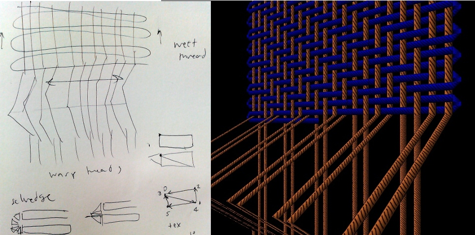
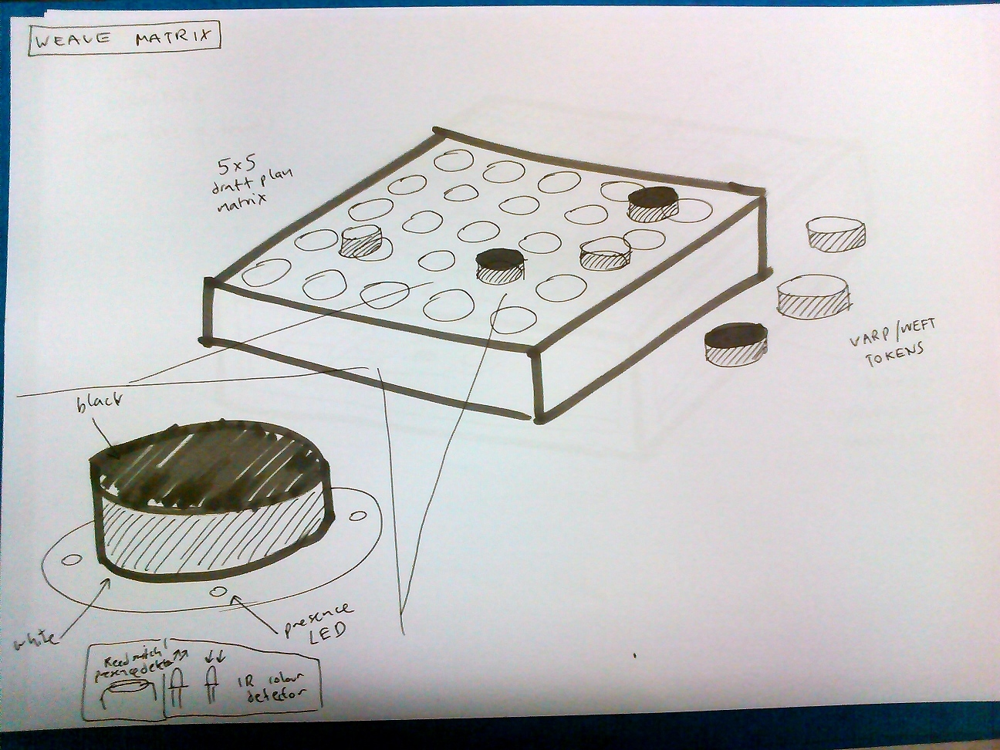
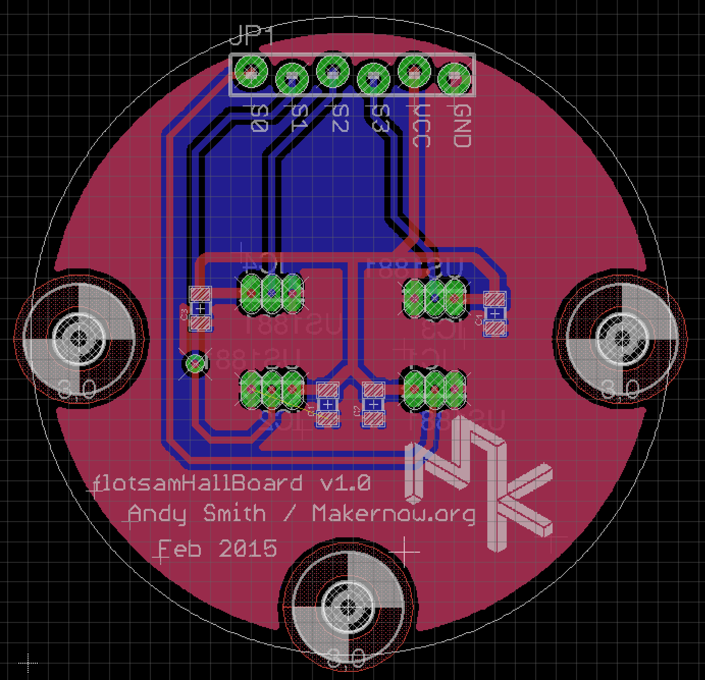
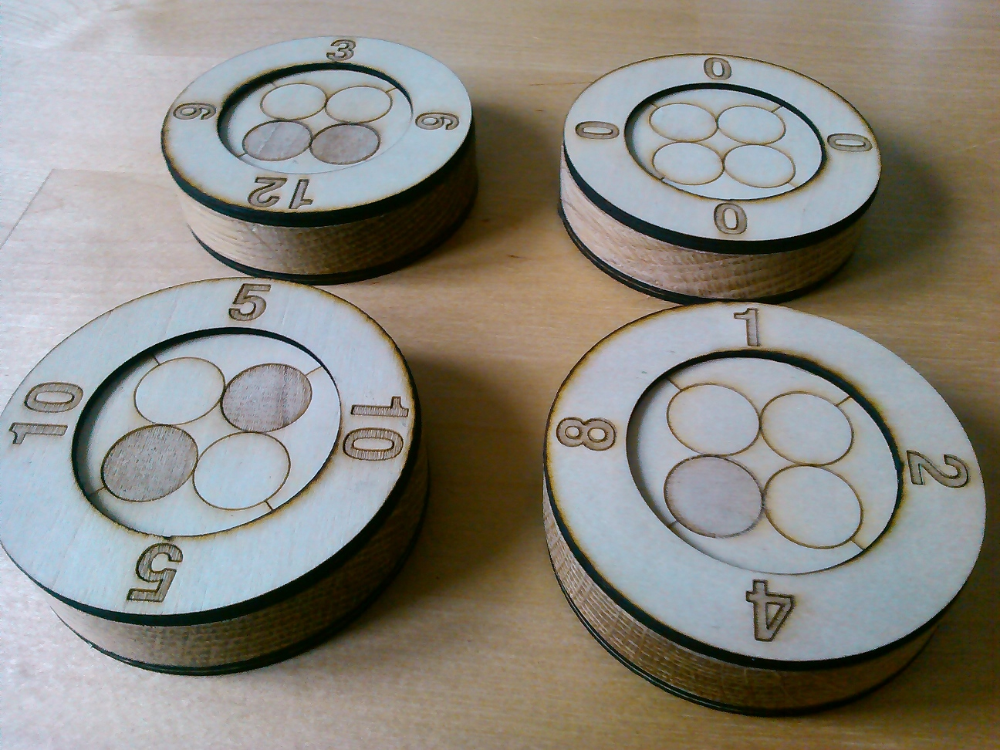

# Pattern matrix warp weighted loom simulation

One of the main objectives of the weavecoding project was to provide a
simulation of the warp weighted loom to use in demonstrations and
exploration of ancient weaving techniques. Beyond the previous
weavecoding simulations we needed to show the actual process of weaving
in order to explain how the structures and patterns emerge. Weaving is
very much a 3 dimensional process and our previous visualisations failed
to show that well. 

We built a 3D procedural rendering system [jellyfish] to build the warp
weighed loom simulation. This was developed specifically for the
project, due to the needs of running on a Raspberry Pi computer, which
allows for easy integration with our experimental hardware.

After out experience with Flotsam, we needed to explore tangible
programming further. The pattern matrix was the next step, open hardware
specialised for weaving and built by Makernow[] and FoAM Kernow for use
in an extra care housing scheme alongside other crafts and technology
workshops as part of Future Thinking for Social
Living[http://ft4sl.tumblr.com/]. We also tested it in a museum setting
during a residency at Munich’s Museum für Abgüsse Klassischer Bildwerke
(Museum of Casts of Classical Sculpture).

A primary objective of this prototype was to remove the need for
physical plugs, which proved problematic as it took people time to learn
how to align the blocks to plug them in to the Flotsam prototype. The
cheapness and availabily of the programming blocks themselves was
important to maintain (partly due to the need for use in public places)
so we used blocks with no connections, painted white and black on
different sides and detect their orientation and position via a magnet
in the centre and hall effect sensors in the base.

Hall effect sensors allow us to detect the polarity of nearby magnetic
fields – and seem to be restricted enough in range that they can be very
precise. Even with fairly weak magnets we found we could put the sensors
right next to each other and still determine the difference between two
opposed or aligned fields.

For the warp/weft weave pattern structure we only need 1 bit of
information to be detected per block, but for other features such as
yarn colour selection we needed to be able to represent more information
(4 bits were encoded in the flotsam blocks).

We used 4 hall effect sensors in a square which meant that we could
detect rotation and flipping of the blocks. Incidentally, this gets very
close to tablet weaving - in terms of the notation and the actions
required to use the device. We can also represent all 16 possible states
with only 4 blocks – if negative is 0 and positive is 1, and we read the
code as binary clockwise from top left these are the four blocks
changing their states with twist and flip:

Starting state [0,1,5,6]

    - -   + -   + -   - +
    - -   - -   - +   - +

Rotate clockwise [0,2,10,12]

    - -   - +   - +   - - 
    - -   - -   + -   + +

Horizontal flip [15,11,10,12]

    + +   + +   - +   - - 
    + +   + -   + -   + +

Rotate counter-clockwise [15,13,5,6]

    + +   + -   + -   - + 
    + +   + +   - +   - +

Vertical flip [0,4,5,6]

    - -   - -   + -   - + 
    - -   - +   - +   - +

Here was the design for the sensor PCB that contained the hall effect sensors under each programming block.

A member of staff at Miners Court trying the first working version of
the tangible weavecoding - in this case the Raspberry Pi displays the
weave structure on the simulated warp weighed loom with a single colour
each for warp and weft threads.

As with the Flotsam prototype, we wanted to keep the system flexible in
terms of later changes and modifications. The blocks are read by a AVR
microcontroller per row which have a set of multiplexers each that allow
you to choose between 20 sensor inputs all routed to an analogue input
pin on the AVR. We’re just using digital here for the hall effect magnet
state, but it means we can try totally different combinations of sensors
without changing the rest of the hardware.

After testing it with elderly people at our Miners Court residency there
were a couple of issues. Firstly the magnets were really strong, and we
worried about leaving it unattended with the programming blocks snapping
together so violently. The other problem was that even with strong
magnets, the placement of the blocks needed to be very precise. This is
probably to do with the shape of the magnets, and the fact that the
fields bend around them and reverse quite short distances from their
edges.

To fix these bugs it was a fairly simple matter to take the blocks
apart, remove 2 of the 3 magnets and add some rings to guide placement
over the sensors properly:

The warp weighted loom simulation was the first one we designed that
included selvedge calculation, as well as animating the shed lift and
weft thread movement.

The threads are calculated in 3D but are represented by thin 'ribbons'
with shading to make them look like they have a round cross
section. This was due to speed limitations on the Raspberry Pi.

The inclusion of the selvedge, along with multiple weft threads for the
colour patterns meant that the possibilities for the selvedge structure
was very high. We didn't yet have a way to notate these possibilities,
but at least we could finally visualise this, and the simulation could
be used to explain these complexities in this ancient weaving technique.

